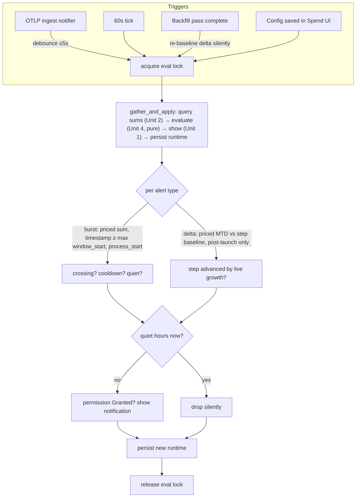

# feat: Cost Notifications (plumbing + burst & delta alerts)

## Overview

Add the desktop-notification foundation to Farthing and the two budget-independent alerts that ride it: a **recurring delta** ("every $N of spend") and a **session/burst** rate alert ("$N in a rolling window", to catch a runaway agent loop). This delivers the notification delivery layer (a new Tauri plugin), windowed spend queries, an alert config + runtime-state model mirroring `capture.rs`, a deterministic evaluation engine, the wiring into the existing ingest pipeline and 60s tick, and a new "Spend" section in the desktop window hosting the rule UI, permission management, and a residency warning.

**Scope split (important).** A parallel [Budgets brainstorm](docs/brainstorms/2026-06-12-budgets-requirements.md) makes daily/monthly **budgets** the canonical spend-target primitive and refactors the monthly-cap *approach/breach* alerts to consume them. Per that brainstorm's own dependency note ("Budgets should ship with or after [the notifications] plumbing"), this plan owns the **plumbing + engine + burst/delta + Spend shell**; the **Budgets plan** owns budget config (daily + monthly), the approach/breach alert groups that consume it, mid-month/immediate-fire, breach quiet-hours catch-up, and the tray/popover visualization. The shared primitives those need — quiet-hours membership, edge-trigger dedup, backfill suppression, the month-boundary helper, priced-only spend queries, `AlertState`, and the notification layer — are all built here so Budgets is a clean extension, not a parallel reimplementation.

## Problem Frame

Farthing's tray total can't *protect*: you won't notice a runaway agent loop spiking spend while you're heads-down, and there's no milestone signal as cost accumulates. This adds notifications that fire only on something notable — a fast burn or a spend milestone — so each carries information the tray cannot. See origin: `docs/brainstorms/2026-06-12-cost-notifications-requirements.md`.

`cost_usd` is API-equivalent (notional for subscription users), so default copy is neutral ("usage alert") with an optional "I pay per-token" flag that switches to real-money framing.

## Requirements Trace

From the origin doc (R1–R21). This plan delivers the budget-independent subset; budget-dependent requirements are engine-ready here and completed by the Budgets plan.

- R1, R2 — Spend section + per-type rule config (for delta + burst) → **Unit 3, Unit 6**
- R3 — API-billing copy flag → **Unit 3, Unit 6**
- R4, R5 — test notification + lazy permission + state surfacing → **Unit 1, Unit 6**
- R6 — recently-fired list → **cut from v1** (see Scope Boundaries)
- R7–R11 — monthly cap window/approach/breach/priced-only/mid-month → **shared primitives here (Unit 2 month helper, Unit 4 generic edge-trigger/quiet-hours); cap-value source, the daily+monthly groups, and mid-month fire are Budgets-plan scope**
- R12, R13 — recurring delta + monthly reset → **Unit 4, Unit 5**
- R14, R15 — burst rolling-window rate + cooldown → **Unit 2, Unit 4, Unit 5**
- R16 — live-only burst/delta; no backfill storm → **Unit 4, Unit 5**
- R17 — per-type quiet hours → **Unit 4, Unit 6**
- R18 — **revised** to display-only (see Key Technical Decisions) → **Unit 1**
- R19 — edge-triggered + de-duplicated → **Unit 4**
- R20 — quiet-hours breach catch-up → **engine primitive here; breach wiring is Budgets-plan scope**
- R21 — residency warning when autostart off → **Unit 6**

## Scope Boundaries

- **Budget-derived approach/breach alerts are not wired here.** The generic edge-trigger/quiet-hours/dedup engine is built and tested, but the cap-value source, the daily + monthly approach/breach groups, mid-month immediate-fire, and breach catch-up are completed by the Budgets plan (which owns the budget config they read). This plan ships **delta + burst** as the working user-facing alerts.
- **No tray/popover budget visualization** — Budgets-plan scope.
- **No notification click-to-navigate** — not supported on macOS desktop (see decisions). Display-only.
- **No new polling/timer** — evaluation hooks into the existing ingest notifier and 60s tick only.
- **No recently-fired list / `ALERT_FIRED` event in v1** — no confirmed consumer; last-fired state persists for debugging regardless. Revisit alongside the Budgets popover work.
- **No change to cost computation; USD only; native OS notifications only.**

### Deferred to Separate Tasks

- **Budgets plan** (`docs/brainstorms/2026-06-12-budgets-requirements.md`): budget config (daily + monthly), approach/breach alert groups consuming budgets (origin R7–R11, R20 wiring), tray-title `%` + ⚠, popover progress bars. Sequenced with or after this plan.
- **Recently-fired list** (origin R6): future iteration.
- **Forecast alert** (origin v2): unchanged.

## Context & Research

### Relevant Code and Patterns

- **Managed state + `meta` persistence**: `src-tauri/src/capture.rs` (`CaptureState::load`, `INSERT ... ON CONFLICT DO UPDATE`, write-then-flip, `apply_paused` fan-out emitting `PAUSED_CHANGED_EVENT`). Template for `AlertState` — **but note** `CaptureState` persists a single `AtomicBool`; `AlertState` holds a composite JSON blob, so it needs its own evaluation lock (see Key Decisions on concurrency).
- **Commands**: single `tauri::generate_handler!` list in `src-tauri/src/lib.rs`; `Result<T, String>` with `.map_err(|e| format!("cannot ...: {e}"))`; DTOs derive `Serialize` (+ `Debug, Clone, PartialEq`).
- **Spend queries**: `src-tauri/src/metrics.rs` — `local_midnight_ms`, `local_day_window`, `metrics_for_window`; headline query uses `COALESCE(SUM(cost_usd), 0.0)` + a separate unpriced count. `src-tauri/src/queries.rs` forces `INDEXED BY idx_requests_facet_rollup` (timestamp_ms-leading).
- **Background hooks**: ingest notifier `IngestNotifier = Arc<dyn Fn(u64) + Send + Sync>` wired in `src-tauri/src/lib.rs`; 60s `tokio::time::interval` loop calls only `tray_title::refresh`. The notifier closure and the two `run_pass` call sites (startup spawn + manual `backfill_run`) all hold an `AppHandle`.
- **Backfill**: `src-tauri/src/backfill.rs` `run_pass(db, pricing, state, root)` — no `AppHandle`, called from tests; inserts past-dated rows with `source='backfill'`. The otel-wins upsert in `ingest.rs` flips a `source='backfill'` row to `'otel'` **and sets `timestamp_ms` to the real event time** on conflict — so `source` is not a reliable live-vs-historical discriminator (see Key Decisions).
- **Migrations**: `src-tauri/src/db.rs` append-only `MIGRATIONS`; `requests` has a real `id INTEGER PRIMARY KEY` (rowid alias); `meta` is `WITHOUT ROWID`.
- **Frontend**: nav arrays `views` / `secondary` in `src/routes/(app)/+layout.svelte` (`showFacets` `$derived` from `views`; `secondary` pages get no facet bar). `src/routes/(app)/settings/+page.svelte` toggle/state/error template (toggles only — not continuous inputs). `src/lib/capture.ts` / `autostart.ts` wrapper template. `src/lib/format.ts` `formatCost`. `src/lib/autostart.ts` `getAutostartStatus() → { enabled, dev_build }`.

### Institutional Learnings

- No `docs/solutions/`; the project's notes are authoritative: `docs/notes/pricing.md` (NULL-cost rows; the COALESCE→$0 trap R10 guards), `docs/notes/dedup-key.md` (idempotent inserts; backfill re-sees line-group heads), `docs/architecture.md` (DST-correct boundaries, index-only window aggregations, `ingest:stored` emit/listen).
- Personal memory `feedback_prefer_ondemand_over_new_cron.md` — fold periodic work into the existing 60s tick; no new cron. This plan does that.

### External References

- **`tauri-plugin-notification` 2.x (current 2.3.3)** — `v2.tauri.app/plugin/notification/`, `docs.rs/tauri-plugin-notification`. Pin `"2.3"` (desktop sound landed 2.3.1). **The repo is already on `tauri 2.11.2` / `@tauri-apps/api ^2`** (Cargo.lock / package.json), well above the plugin's needs — no core-version alignment required.
  - Drive from **Rust** via `NotificationExt` (`permission_state()`, `request_permission()`, `.builder().title().body().show()`); `AppHandle` is `Send+Sync+Clone`, safe in a tokio task.
  - **Click/action handling is mobile-only** (tauri#3698 open; plugins-workspace#1903) → R18 revision.
  - **macOS gotchas**: notifications are unreliable under `tauri dev` (silent no-op); validate with a bundled, signed `.app` in `/Applications`. Bundle ID is real (`com.peason.farthing`). Denied permission can't be re-prompted programmatically — detect `Denied`, deep-link to System Settings. Delivery works with windows hidden under `ActivationPolicy::Accessory` and doesn't steal focus.

## Key Technical Decisions

- **Notifications are display-only; tray "Open Farthing" is the re-entry path (revises R18).** macOS desktop has no notification click callback in Tauri 2 (mobile-only Actions API; tauri#3698 unimplemented). Notifications show title/body only.
- **Live-vs-historical discrimination = event-time `timestamp_ms >= process_start_ms`, not `source`.** The otel-wins upsert flips a backfill row to `source='otel'` with its real (recent) timestamp, so a `source='otel'` filter is defeated when a runaway session that happened *while the app was off* gets recovered by backfill and then re-delivered by the OTLP exporter. Instead, capture `process_start_ms` (wall clock) at startup; burst and delta count only spend timestamped at/after launch. Recovered pre-launch rows are dated before boot and excluded regardless of source flips or row id. Within normal operation (app up > window length) the rolling-window start is the binding constraint and the gate is inert. (Resolves the flow-analysis C1 storm and retires the deferred rowid-high-water question.)
- **Delta re-baselines on backfill; never fires retroactively.** On each backfill-pass completion, set the delta step baseline to current MTD silently (no fire). Combined with the `process_start_ms` gate, only post-launch live spend advances delta steps. (C6/C7.)
- **Evaluation is a serialized critical section.** The DB mutex serializes *statements*, not the read→evaluate→persist cycle of the cached runtime blob; concurrent ingest-path, 60s-tick, and config-save evaluations could otherwise interleave into a lost update (double-fire, or a dropped flag). `AlertState` holds a dedicated eval lock held across the whole `gather_and_apply` cycle, making evaluations mutually exclusive. (Resolves adversarial lost-update finding.)
- **Burst evaluation is debounced to ≤5s, decoupled from per-export firing.** A runaway loop emits many exports/sec; per-export evaluation would serialize a query behind every ingest write. Coalescing to ≤5s holds the "within ~1 min" budget while bounding contention. A genuinely distinct second burst arriving inside the 15-min cooldown is suppressed by design (accepted limitation, documented in Risks).
- **Rollover and quiet-hours membership are state-derived from the wall clock.** Every evaluation derives `current_month_key` from `Local::now()`; no midnight alarm; `tokio::time::interval` tick *count* is never relied on. Quiet-hours membership is wrap-aware. (C3/C4, I1.)
- **All durations stored as UTC unix-ms; local time only for quiet-hours membership and month-key derivation.** Survives DST fall-back; the new month-boundary helper mirrors the DST-correct `local_midnight_ms`. (M2.)
- **Config + runtime persist as JSON in `meta`, cached in `AlertState`.** Mirrors `CaptureState`; a dedicated table rejected for YAGNI (tiny state, evolving shape as Budgets extends it). The eval lock (above) provides the atomicity the single-atomic `CaptureState` got for free.

## Open Questions

### Resolved During Planning

- *Plan scope vs Budgets?* Split: plumbing + engine + burst/delta here; budget config + approach/breach wiring + viz in the Budgets plan (per user decision).
- *Live-vs-historical discrimination?* `process_start_ms` event-time gate (decision above) — supersedes both `source`-only and the rowid-high-water fallback.
- *Concurrency on runtime state?* Dedicated eval lock across the full evaluate cycle.
- *Notification delivery / click / version?* Rust `NotificationExt`, plugin `"2.3"`, display-only; repo already on `tauri 2.11.2` (no alignment needed).
- *Burst default?* Enabled by default at **$10 in 10 min, 15-min cooldown** (per user decision — less twitchy than $5 to avoid firing on legitimate heavy sessions, while still guarding day one).

### Deferred to Implementation

- Precise debounce primitive (last-eval-timestamp guard vs trailing timer; target ≤5s) and whether burst also re-checks on the 60s tick.
- Delta default step ($50) and quiet-hours defaults — user-tunable.
- Whether `evaluate` and `AlertState` share `src-tauri/src/alerts.rs` or split into an `alerts/` submodule once the engine grows (Budgets will extend it).
- Svelte component test depth — repo gates on `svelte-check`/eslint; verification leans on `pnpm check` + manual bundle testing.

## High-Level Technical Design

> *This illustrates the intended approach and is directional guidance for review, not implementation specification. The implementing agent should treat it as context, not code to reproduce.*

The decision core is a **pure function** `evaluate(now, config, runtime, sums) -> (notifications, new_runtime)` (no clock, no DB) — deterministically unit-testable. Note the live-vs-historical discrimination lives in the **query assembly** (which rows feed `sums`), *not* inside `evaluate`, so that query-construction logic carries its own tests (it is the highest-risk correctness surface).

## Implementation Units

### Phase 1 — Foundation

- [ ] **Unit 1: Notification delivery layer**

**Goal:** Add the notification plugin and a Rust wrapper that gates every send on permission state and reports delivery outcome (so callers can record a permission-lost signal).

**Requirements:** R3 (copy input), R4 (test), R5 (permission), R18 (display-only).

**Dependencies:** None.

**Files:**
- Modify: `src-tauri/Cargo.toml` (`tauri-plugin-notification = "2.3"`)
- Modify: `src-tauri/src/lib.rs` (`.plugin(tauri_plugin_notification::init())`; register commands)
- Modify: `src-tauri/capabilities/default.json` (add `notification:default` — note: a **no-op for the pure-Rust delivery path**, which isn't capability-gated; included only for forward-compat if a webview affordance is added later)
- Create: `src-tauri/src/notify.rs`
- Test: inline tests in `src-tauri/src/notify.rs`

**Approach:**
- `fn show(app, title, body) -> ShowOutcome` — checks `permission_state()`; if not `Granted`, returns a `PermissionDenied` outcome and skips delivery (does **not** error, does **not** itself mutate `AlertState`). The caller (Unit 5 orchestrator) records the permission-lost signal — this keeps Unit 1 dependency-free and avoids a circular reference to Unit 3.
- Commands: `notification_permission_state() -> String`, `notification_request_permission() -> String`, `notification_send_test(rule_type) -> Result<(), String>` (representative **placeholder** values, e.g. "$12.40 in the last 10 minutes (sample)", never live data).
- Display-only; no actions/click handlers.

**Patterns to follow:** `capture.rs` command/result convention; plugin registration beside existing `.plugin(...)` calls.

**Test scenarios:**
- Happy path: `show` with permission `Granted` invokes the builder via a trait/seam (so tests don't hit the OS); returns `Delivered`.
- Edge case: `show` with `Denied`/`Unknown` returns `PermissionDenied`, attempts no delivery.
- Happy path: `notification_send_test` produces sample copy per rule type with placeholder values, independent of DB rows.
- Serialization: permission-state return matches the expected string enum.

**Verification:** `cargo test` passes; manual — a bundled `.app` in `/Applications` shows a test notification (not `tauri dev`).

- [ ] **Unit 2: Spend query helpers**

**Goal:** A DST-correct month-boundary helper (shared with the Budgets plan — build once) and priced-only windowed spend queries with an event-time floor and optional source filter.

**Requirements:** R10 (priced-only + unpriced count), R13 (monthly reset boundary), R14 (rolling window).

**Dependencies:** None.

**Files:**
- Modify: `src-tauri/src/metrics.rs` (`local_month_start_ms` / month-window helper beside `local_midnight_ms`; a priced-sum + unpriced-count query for `[start, end)` with an optional `min_timestamp_ms` floor)
- Test: inline tests in `src-tauri/src/metrics.rs`

**Approach:**
- Month helper: first-of-month `NaiveDate` → `local_midnight_ms`; month-end = first-of-next-month boundary; mirror the day-window pattern.
- Priced-sum query: `SUM(cost_usd) WHERE cost_usd IS NOT NULL AND timestamp_ms >= ?1 AND timestamp_ms < ?2` + unpriced count, single `query_row` (mirror `metrics_for_window`). Accept an optional event-time floor param so burst can pass `max(now - window, process_start_ms)`.
- Force `INDEXED BY idx_requests_facet_rollup`.

**Patterns to follow:** `metrics.rs` `metrics_for_window` / `local_day_window`; `queries.rs` index-forcing.

**Test scenarios:**
- Happy path: mid-month `now` → first-of-month 00:00 local to first-of-next-month 00:00 local.
- Edge case: Dec→Jan year rollover; Feb 28/29; DST transition in the month doesn't shift the start off local midnight.
- Happy path: priced-sum excludes `cost_usd IS NULL`; returned unpriced count = excluded `api_request` rows in window.
- Edge case: empty window → `(0.0, 0)`.
- Happy path: rolling-window sum with an event-time floor excludes rows timestamped before the floor (the `process_start_ms` storm guard).

**Verification:** `cargo test` passes.

### Phase 2 — Engine and wiring

- [ ] **Unit 3: Alert config + runtime-state model (`AlertState`)**

**Goal:** Managed `AlertState` (mirroring `CaptureState`) holding config + runtime as JSON in `meta`, with an eval lock, `process_start_ms`, get/set commands, the API-billing flag, and the permission-lost signal. Scoped to **delta + burst** rules (Budgets extends it with budget config later).

**Requirements:** R2, R3, R5 (state surfacing), R19 (dedup state), R17 (quiet-hours config).

**Dependencies:** Unit 1.

**Files:**
- Create: `src-tauri/src/alerts.rs` (types, load/persist, eval lock, commands, event constant)
- Modify: `src-tauri/src/lib.rs` (`AlertState::load`, `app.manage(...)`, capture `process_start_ms`, register commands)
- Create: `src/lib/spend.ts` (TS interfaces + wrappers + event const)
- Test: inline tests in `src-tauri/src/alerts.rs`

**Approach:**
- Config JSON (`meta` key `alert_config`): delta (`step_usd` default $50, `enabled`, quiet window), burst (`threshold_usd` default $10, `window_minutes` default 10, `cooldown_minutes` default 15, `enabled` **default true**, quiet window), global `api_billing` flag (default off). Shape leaves room for budget-derived approach/breach config added by the Budgets plan.
- Runtime JSON (`meta` key `alert_runtime`): delta `{ month_key, last_step }`; burst `{ cooldown_until_ms }`; `permission_lost` bool.
- `process_start_ms`: captured at startup, in-memory (process lifetime).
- Eval lock: a `Mutex<()>` (or the existing data mutex) held across `gather_and_apply`.
- Resilient load (defaults on absent/malformed JSON — copy `CaptureState::load`).
- Commands: `alert_config_get`, `alert_config_set` (persist + re-evaluate + emit `ALERT_CONFIG_CHANGED`).

**Patterns to follow:** `capture.rs`; `src/lib/capture.ts`.

**Test scenarios:**
- Happy path: load with no `meta` keys → documented defaults (burst enabled $10/10min/15min; delta disabled $50).
- Happy path: set → persist → reload round-trips config + runtime.
- Serialization: DTOs match expected JSON (`to_value` vs `json!`).
- Edge case: malformed stored JSON → defaults, no panic.
- Integration: `alert_config_set` emits `ALERT_CONFIG_CHANGED` and triggers a re-evaluation (mock the eval seam).

- [ ] **Unit 4: Alert evaluation engine (burst + delta)**

**Goal:** Pure decision logic for burst and delta, plus the shared primitives the Budgets plan will reuse (wrap-aware quiet-hours membership, `month_key`, edge-trigger/cooldown).

**Requirements:** R12, R13, R14, R15, R16, R17, R19.

**Dependencies:** Unit 2 (sums), Unit 3 (types).

**Files:**
- Modify: `src-tauri/src/alerts.rs` (`evaluate(...)` + helpers: `month_key`, `in_quiet_hours` wrap-aware, delta step math)
- Test: inline tests in `src-tauri/src/alerts.rs` (the bulk of the unit)

**Approach:**
- `evaluate(now, config, runtime, sums) -> (Vec<Notification>, Runtime)` — no clock, no DB.
- Delta: `step = floor(post_launch_priced_MTD / step_usd)`; fire iff `step > last_step` and not in quiet hours; advance `last_step`. On month rollover (`month_key` changed) reset baseline. Backfill re-baseline (Unit 5) bumps `last_step` silently before live eval.
- Burst: fire iff priced rolling-window sum (event-time floored at `process_start_ms`) ≥ `threshold_usd` and `now >= cooldown_until_ms` and not quiet; set `cooldown_until_ms = now + cooldown`.
- Quiet hours: wrap-aware (`start<=end ? start<=t<end : t>=start||t<end`); suppressed delta/burst drop silently.

**Execution note:** Test-first. The flow-analysis edge cases (C6, C7, I1, I4, M2, plus the cooldown/process_start scenarios) are the spec — write them as a scenario table of `evaluate` cases before implementing.

**Patterns to follow:** pure-function table tests as in `metrics.rs` window tests.

**Test scenarios:**
- Happy path: priced spend crosses a $N step → one delta; second eval same step → silent.
- Edge case (C6): `last_step` pre-bumped (simulating backfill) → only post-bump live growth fires; no retroactive flood.
- Edge case (C7): step-size edit re-baselines → no flood of passed steps.
- Happy/Edge (R14/R15): rolling sum ≥ threshold fires + arms cooldown; over-threshold eval within cooldown does not fire; after cooldown fires again.
- Edge case (storm guard): rows timestamped before `process_start_ms` excluded from the burst sum → no fire (verified via the Unit 2 floor + an `evaluate` case with only pre-launch spend in `sums`).
- Edge case (I1): wrap quiet window (22:00–07:00) classifies 23:30/02:00 as quiet, 08:00 not.
- Edge case (R17): delta/burst in quiet hours drop silently (no pending flag).
- Edge case (M2): cooldown compared in UTC ms unaffected by a DST fall-back repeated local hour.

- [ ] **Unit 5: Wire evaluation into the runtime**

**Goal:** Connect the engine to its triggers under the eval lock, and record permission-lost.

**Requirements:** R12–R16 end-to-end, R5 (permission-lost surfacing).

**Dependencies:** Units 1–4.

**Files:**
- Modify: `src-tauri/src/lib.rs` (debounced burst/delta eval in the ingest notifier closure; delta month-rollover + permission re-check in the 60s tick loop)
- Modify: `src-tauri/src/backfill.rs` call sites — hook the delta re-baseline **at the two `run_pass` call sites that hold an `AppHandle`** (startup spawn beside `tray_title::refresh(&backfill_app)`, and `backfill_run` beside its refresh), **not inside `run_pass`** (which has no handle and is unit-tested without one)
- Modify: `src-tauri/src/alerts.rs` (`gather_and_apply(app)` orchestrator: acquire eval lock → query sums → `evaluate` → `show` via Unit 1 → record permission-lost → persist runtime → release)
- Test: inline + `tauri::test::mock_builder` integration tests; `backfill.rs` tests

**Approach:**
- Ingest path: debounce/coalesce to ≤5s (last-eval-timestamp guard) → burst + delta eval. Decide execution context (spawned task vs inline) so the windowed query doesn't stall behind a backfill-held DB lock; document the choice.
- 60s tick: append `gather_and_apply` after `tray_title::refresh` for delta month-rollover (state-derived) and a cheap permission re-check (surface `permission_lost`).
- Backfill completion: bump delta `last_step` to current MTD silently.
- Eval lock makes ingest-path, tick, and config-save evals mutually exclusive (no lost update).

**Test scenarios:**
- Integration (storm guard): launch with backfill recovering rows dated before launch — including a row later flipped to `source='otel'` by a re-delivered export — produces **no** burst/delta (the `process_start_ms` event-time floor excludes them). *This test must include the otel-flip, not just static backfill rows.*
- Integration (I4): two over-threshold otel batches 30s apart → exactly one burst (cooldown persists).
- Integration (concurrency): a config-save eval and an ingest eval racing → the eval lock serializes them; no double-fire.
- Edge case (R5/I6): permission revoked mid-use → next `show` returns `PermissionDenied`, orchestrator sets `permission_lost`.
- Note: these assert the `evaluate`+`show()`-seam contract under the mock runtime; **real OS delivery/dedup is verified only by manual bundle testing** (see System-Wide Impact).

**Verification:** `cargo test` passes; manual bundle test — scripted spend spike → single burst; cold launch with recent transcript history → no notifications.

### Phase 3 — UI

- [ ] **Unit 6: Spend section (Svelte)**

**Goal:** A new "Spend" page hosting the delta + burst rule cards, permission management, residency warning, API-billing toggle, and per-rule test buttons. (Budget cards arrive with the Budgets plan.)

**Requirements:** R1–R5, R17 (quiet-hours UI), R21 (residency warning).

**Dependencies:** Units 1, 3.

**Files:**
- Create: `src/routes/(app)/spend/+page.svelte`
- Modify: `src/routes/(app)/+layout.svelte` (add `{ route: "/(app)/spend", label: "Spend" }` to `secondary` — no facet bar)
- Use: `src/lib/spend.ts`, `src/lib/autostart.ts`, `src/lib/format.ts`
- Test: `pnpm check`/eslint + manual

**Approach & interaction states** (addressing design-lens findings):
- **Cards**: a delta card and a burst card, each with enable toggle + threshold input(s) + a collapsed quiet-hours sub-row.
- **First-run/empty state**: with delta disabled (and burst enabled by default), show each card with its controls; no blank-page state. Disabled-rule inputs are visible but disabled (not hidden), pre-filled with defaults.
- **Save model**: numeric inputs auto-save on a 500ms debounce after last keystroke **plus** on blur (toggles save immediately); after the backend call, re-read returned state into `$state`. On save failure, revert the input to the last confirmed value and show an inline error; validation errors (burst window ≥ 1 min, thresholds > 0) block the save and show inline without reverting.
- **Quiet-hours sub-row**: a chevron expands/collapses; collapsed summary reads "Quiet hours: 10:00 PM – 7:00 AM" or "Quiet hours: off"; native `<input type="time">` start/end; a wrap-around window (start > end) is labeled "overnight"; `start == end` is disallowed (treated as unset). Same debounce/save path as numeric inputs.
- **Permission surface**: states never-requested → (button triggers `request_permission`; transient "requesting…") → granted / denied. Denied (and the distinct `permission_lost` revoked-after-grant case) show a `.warn-box` with a button that opens System Settings.
- **Residency warning**: when `getAutostartStatus().enabled === false` and `dev_build === false`, show a `.warn-box` ("alerts only run while Farthing is open") with one-click enable; on enable failure show an inline error; suppress the warning when `dev_build === true`.
- **Loading state**: the page reads `alert_config_get` + permission + autostart on mount; render a lightweight skeleton/disabled state until resolved so toggles never flash a wrong value.
- **API-billing toggle** (top): switches the page's neutral labels to real-money wording; page-scoped (does not change the tray or other sections in this plan). Enumerate the affected strings during implementation.

**Patterns to follow:** `src/routes/(app)/settings/+page.svelte` (state/error, multi-screen state machine), `src/lib/capture.ts` wrapper shape, existing `.warn-box`/`.error-box` styling.

**Test scenarios:** `Test expectation: none beyond static checks` — repo gates on `pnpm check` + eslint. Manual: toggle each rule, edit thresholds (incl. invalid), set an overnight quiet window, deny permission and confirm recovery, disable autostart and confirm the warning (and its suppression in a dev build), send a test notification per rule.

**Verification:** `pnpm check`, `pnpm lint`, `pnpm format:check` clean; manual walkthrough in a bundled `.app`.

## System-Wide Impact

- **Interaction graph:** new reads off the ingest notifier closure and the 60s tick loop in `lib.rs`, and a delta re-baseline at the two `run_pass` call sites in `backfill.rs`/`lib.rs`. Ingest write semantics and the receiver are untouched.
- **Concurrency:** all evaluation runs under the `AlertState` eval lock (ingest-path, tick, config-save mutually exclusive); runtime JSON RMW is atomic per evaluation. The DB mutex is acquired inside, for queries and the persist write, and released between — the eval lock, not the DB mutex, provides cycle atomicity.
- **Error propagation:** send failures / permission-denied become a surfaced `permission_lost` state, never command errors; a failed eval is logged and skipped so it never crashes the tick or ingest path.
- **Test reach:** the storm-guard, cooldown, and concurrency behaviors are provable under the mock runtime at the `evaluate`+`show()` seam; **actual OS notification delivery and dedup are manual-bundle-only** (the mock runtime has no notification backend, and `tauri dev` is unreliable for notifications).
- **Unchanged invariants:** `requests`/`sessions` schema, ingest/upsert, pricing, existing metrics queries. New work is additive (`meta` keys, new module, new route).
- **Forward seam for Budgets:** `AlertState` config/runtime shape, the month-boundary helper, the priced-only query, quiet-hours/dedup primitives, and the notification layer are all reused by the Budgets plan's approach/breach groups.

## Risks & Dependencies

| Risk | Mitigation |
|------|------------|
| Notifications silently fail under `tauri dev` (macOS) | Validate with a bundled signed `.app` in `/Applications`; documented in verification. Bundle ID already real. |
| Click-to-navigate expected by origin R18 but unsupported | Revised to display-only + tray re-entry; platform limit, not a cut feature. |
| Backfill (startup or manual) + otel re-delivery flip trips a burst storm | `process_start_ms` event-time floor excludes all pre-launch spend regardless of `source` flips; delta re-baselines silently on backfill. Integration test includes the flip case. |
| Burst eval contends with ingest write under load | Debounce ≤5s; execution-context choice documented so a windowed query can't stall behind a backfill-held DB lock. |
| Concurrent evals lose updates / double-fire | Eval lock held across the full read→evaluate→persist cycle. |
| Distinct second burst during the 15-min cooldown is suppressed | Accepted limitation for v1 (cooldown > window by design — one runaway-loop alert per cooldown). Revisit if real use shows missed distinct spikes. |
| Permission denied/revoked → silent non-coverage | Re-check on each `show` + 60s tick; surface `permission_lost`; deny can't re-prompt, so deep-link to System Settings. |
| DST / clock changes double-fire or skip | UTC ms for durations; local time only for quiet/month membership via the DST-correct helper; explicit fall-back test. |
| **Dependency:** Budgets plan completes approach/breach | This plan ships delta + burst as working alerts; approach/breach are engine-ready and wired by the Budgets plan, which reads the shared budget config. |

## Documentation / Operational Notes

- Add a `docs/notes/` entry on the alert `meta` keys and the `process_start_ms` live-vs-historical rule (the "why not `source`" rationale matters for the Budgets follow-on).
- Changeset required before PR (`pnpm changeset`) — user-facing deployable app.
- Pin `tauri-plugin-notification = "2.3"`; no `tauri` core bump needed (repo on 2.11.2).

## Alternative Approaches Considered

- **Own a monthly cap value in this plan** — rejected per the Budgets brainstorm (two-configs-drift); the cap value is the monthly budget, owned by Budgets.
- **`source='otel'` as the live discriminator** — rejected: the otel-wins upsert flips backfill rows to `otel` with recent timestamps, defeating it. `process_start_ms` event-time floor is robust.
- **Widen `IngestNotifier` to carry spend** — rejected: the evaluator must query windowed sums regardless; avoids a signature ripple.
- **Dedicated `alert_*` tables** — rejected for v1: tiny, evolving state; `meta`-JSON + eval lock suffices.
- **Custom `UNUserNotificationCenter` delegate for click handling** — rejected for v1: heavy Obj-C/`objc2` scope, signing-sensitive.

## Sources & References

- **Origin document:** [docs/brainstorms/2026-06-12-cost-notifications-requirements.md](docs/brainstorms/2026-06-12-cost-notifications-requirements.md)
- **Related feature:** [docs/brainstorms/2026-06-12-budgets-requirements.md](docs/brainstorms/2026-06-12-budgets-requirements.md) (consumes this plan's plumbing)
- Related code: `src-tauri/src/capture.rs`, `metrics.rs`, `ingest.rs`, `lib.rs`, `backfill.rs`, `db.rs`, `queries.rs`, `src/routes/(app)/settings/+page.svelte`, `src/routes/(app)/+layout.svelte`, `src/lib/capture.ts`, `src/lib/autostart.ts`
- Project notes: `docs/notes/pricing.md`, `docs/notes/dedup-key.md`, `docs/architecture.md`
- External: [Notifications | Tauri v2](https://v2.tauri.app/plugin/notification/), [docs.rs/tauri-plugin-notification](https://docs.rs/tauri-plugin-notification/), [tauri#3698](https://github.com/tauri-apps/tauri/issues/3698), [plugins-workspace#1903](https://github.com/tauri-apps/plugins-workspace/issues/1903), [plugins-workspace#2143](https://github.com/tauri-apps/plugins-workspace/issues/2143)
