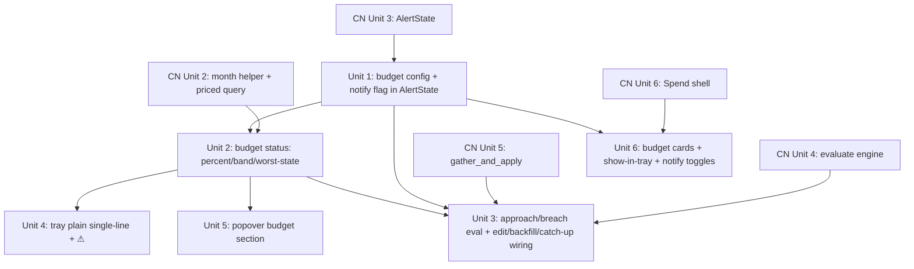

# feat: Budgets (daily & monthly spend targets + visualization)

## Overview

Make daily and monthly **budgets** a first-class primitive in Farthing: an optional daily amount and an optional monthly amount, defined once, then surfaced in the tray title (percent-used + ⚠), the popover (color-coded progress bars), and desktop notifications (approach + breach for both budgets). Budgets are the canonical spend-target config; the cost-notifications feature's monthly approach/breach alerts consume them rather than holding their own cap value.

This plan is a **clean extension of the cost-notifications plan** (`docs/plans/2026-06-12-001-feat-cost-notifications-plan.md`), which builds and ships first. That plan delivers every shared primitive this one needs: the notification delivery layer, the DST-correct month-boundary helper, priced-only windowed spend queries with a `process_start_ms` event-time floor, the `AlertState` config/runtime model + eval lock, the wrap-aware quiet-hours / edge-trigger / dedup engine, `gather_and_apply`, and the "Spend" section shell. The Budgets work adds budget config to `AlertState`, the daily+monthly approach/breach groups that read it, the tray/popover visualization, and the budget cards in the Spend section.

## Problem Frame

Farthing's tray shows "$123 today" but offers no *target* to measure against — no ceiling, no progress, no sense of pace. Budgets add that target and make it visible everywhere spend is shown. See origin: `docs/brainstorms/2026-06-12-budgets-requirements.md`.

`cost_usd` is API-equivalent (notional for subscription users), so budget framing inherits the cost-notifications plan's neutral copy + optional "I pay per-token" flag. Cost computation is unchanged. Spend measured against a budget is **priced-only**: unpriced rows (`cost_usd IS NULL`) are excluded from the sum and their count disclosed, so a budget never shows a healthy color while priced usage is over it (see origin: `docs/notes/pricing.md`).

## Requirements Trace

From the origin doc (R1–R17). Shared-primitive references point at the cost-notifications plan ("CN Unit N").

- R1 — daily + monthly budget config, each optional with enable flag → **Unit 1**
- R2 — configured from the Spend section → **Unit 6** (shell from CN Unit 6)
- R3 — daily window `[midnight, next_midnight)`; monthly = local calendar month → **Unit 2** (reuses `local_day_window`; `local_month_start_ms` from CN Unit 2)
- R4 — priced-only spend + disclose unpriced count → **Unit 2** (query from CN Unit 2)
- R5 — tray shows spend + per-budget percent (single-line; see Key Decisions) → **Unit 4**
- R6 — *per-band color tinting in tray* → **CUT** (see Scope Boundaries / Key Decisions). The plain single-line tray (Unit 4) plus the colored popover bars (Unit 5) carry the band signal; the native attributed-string tinting is not worth the objc2 dependency + Tauri version-pin for a one-maintainer tool.
- R7 — user toggle to show/hide budget figures in tray → **Unit 1 (config), Unit 4 (render), Unit 6 (toggle UI)**
- R8 — ⚠ in tray at amber+ (worst across budgets), independent of R7 toggle → **Unit 2 (worst-state), Unit 4 (render)**
- R9 — four contiguous color bands (green ≤50 / yellow >50–75 / amber >75–90 / red >90), rounded percent → **Unit 2**
- R10 — popover budget section with labeled progress bars → **Unit 5**
- R11 — ⚠ on amber+ rows; distinguish approaching vs exceeded (≥100%) → **Unit 5**
- R12 — budget section appears only when a budget is set → **Unit 5**
- R13 — approach (default 76%) + breach (100%) notifications for both daily and monthly, edge-triggered once per period; **each budget has its own `notify` on/off flag** so the visual can ship without the interruption → **Unit 1 (config + notify flag), Unit 3 (eval respects flag), Unit 6 (toggle UI)**
- R14 — per-budget/period/threshold dedup; quiet-hours/residency/unpriced behavior inherited → **Unit 3** (primitives from CN Unit 4/5)
- R15 — monthly budget is the authoritative threshold the notifications cap-rule reads → **Unit 1 (config), Unit 3 (wiring)**
- R16 — mid-period edit clears that budget's latches + re-evaluates on save → **Unit 3**
- R17 — visual reflects true total (incl. backfill); notifications fire on live progress only; **both daily and monthly get a once-per-period launch/backfill catch-up** (refines the origin's "daily none" — see Key Decisions) → **Unit 2 (status: no floor), Unit 3 (notify: floor + catch-up)**
- R20 *(CN brainstorm namespace, not in this origin's R1–R17)* — quiet-hours breach catch-up for the monthly budget → **Unit 3**. CN builds the generic quiet-hours primitive; the budget-specific catch-up wiring is built here.

## Scope Boundaries

- **No per-project / weekly / custom-period budgets** — daily and monthly, account-wide, only.
- **No hard enforcement** — budgets warn and visualize; they never pause capture, block requests, or change Claude behavior.
- **No two-line stacked tray title** — infeasible without a custom `NSView` in the status button (see Key Decisions); single line is the spec.
- **No colored tray tinting (R6 cut)** — the native `NSStatusItem` attributed-string path is feasible but not worth the objc2 dependency + Tauri version-pin + recurring upgrade-tax for a one-maintainer tool. The ⚠ glyph + the colored popover bars carry the band signal; the tray text is plain.
- **No notification click-to-navigate** — display-only on macOS desktop (inherited from CN plan; revises origin R-series cross-refs).
- **No new polling/timer** — period rollover and re-evaluation ride the existing 60s tick and ingest notifier (inherited).
- **No change to cost computation; USD only.**

### Deferred to Separate Tasks

- **Cost-notifications plan** (`docs/plans/2026-06-12-001-feat-cost-notifications-plan.md`): all shared plumbing (notification layer, month helper, priced-only queries, `AlertState`, eval engine, `gather_and_apply`, Spend shell, burst/delta alerts). **Must ship first or alongside.**
- **Forecast alert** (origin v2): unchanged, out of scope.

## Context & Research

### Relevant Code and Patterns

- **`AlertState` (config + runtime as JSON in `meta`, eval lock, `process_start_ms`)** — built in CN Unit 3, explicitly shaped to accept budget config. Budgets extend its config/runtime JSON rather than creating a parallel `BudgetState`. Template root: `src-tauri/src/capture.rs` (`CaptureState::load`, write-then-mutate, `apply_*` fan-out, `*_CHANGED` event).
- **Spend query helpers** — `src-tauri/src/metrics.rs`: `local_day_window`, `local_midnight_ms`, `metrics_for_window`; CN Unit 2 adds `local_month_start_ms` and a priced-only `SUM(cost_usd) WHERE cost_usd IS NOT NULL AND timestamp_ms >= ?1 AND timestamp_ms < ?2` + unpriced count with an optional event-time floor. `src-tauri/src/queries.rs` forces `INDEXED BY idx_requests_facet_rollup` (timestamp-leading, index-only window scans).
- **Tray title** — `src-tauri/src/tray_title.rs`: `format_title(cost_usd, paused) -> String`, `refresh<R>(app)` dispatches `tray.set_title(Some(..))` via `app.run_on_main_thread` (tray mutations off-main are silently dropped); always passes a non-empty string (`set_title(None)` no-clear quirk). Five refresh call sites: `tray::setup`, ingest notifier (`lib.rs`), backfill completion, `apply_paused`, 60s tick. `set_title` takes a plain string only — colored text would require the native `NSStatusItem` escape hatch, which this plan does **not** pursue (R6 cut; see Alternatives).
- **Popover** — `src/routes/popover/+page.svelte`: section order (header → cost → unpriced footnote → tokens → sessions → trend → projects → footer); `refresh()` does `Promise.all` of metrics commands; single `$effect` registers a `window` `"focus"` listener, `listen(INGESTED_EVENT)` with a 200ms trailing debounce, and `listen(PAUSED_CHANGED_EVENT)`; dark-mode `@media (prefers-color-scheme: dark)` block with the accent convention (active `#0a84ff`/`#409cff`; amber `rgba(255,159,10,..)` + `#93530a`/`#ffb55c`; error `#b42318`/`#ffa198`).
- **Frontend command pattern** — `src/lib/<feature>.ts` exports serde-mirroring TS interfaces + thin `invoke<T>("cmd", argsObj)` wrappers + event-name constants. CN Unit 3 creates `src/lib/spend.ts`. All `#[tauri::command]`s register in the single `generate_handler!` list in `src-tauri/src/lib.rs`.
- **Settings/Spend UI** — CN Unit 6 builds `src/routes/(app)/spend/+page.svelte` (rule cards, permission, residency, API-billing toggle, debounced auto-save + blur, inline validation). `src/routes/(app)/settings/+page.svelte` is the toggle/state/error template.

### Institutional Learnings

- No `docs/solutions/`; project notes are authoritative: `docs/notes/pricing.md` (NULL-cost rows; the `COALESCE→$0` trap R4 guards), `docs/architecture.md` (DST-correct boundaries, index-only window aggregations, `ingest:stored` emit/listen).
- Personal memory `feedback_prefer_ondemand_over_new_cron.md` — fold periodic work into the 60s tick; no new timer. Period rollover derives day/month keys from `Local::now()` each tick.
- Personal memory `feedback_reuse_over_reimplement.md` — this plan is a composition of CN primitives; large net-new backend line counts would be a red flag, not progress. The genuinely new surfaces are the tray rendering and the popover/Spend UI.

### External References

- Tray rendering feasibility (verified against `Cargo.lock`): `set_title` is a plain-string-only API (`tauri-2.11.2/src/tray/mod.rs:538`); plain titles auto-adapt to light/dark for free. Colored substrings are *possible* via the native escape hatch (`with_inner_tray_icon` → `ns_status_item` → `setAttributedTitle`, objc2 already in the tree) but the plan cuts that (R6) — see Alternatives for the rationale and the path if it's ever revisited. Two stacked lines: only via a custom embedded `NSView` (Multi.app pattern) — out of scope.

## Key Technical Decisions

- **Budgets extend `AlertState`, not a new `BudgetState`** (R1, R15): CN Unit 3's config/runtime JSON was shaped to host budget config. A `budgets` block joins `alert_config`; per-period budget dedup latches + monthly catch-up state join `alert_runtime`. The monthly budget amount is the single authoritative value the (deferred) CN monthly cap-rule reads — no second config to drift.
- **Tray title is single-line plain text** (revises origin R5; R6 cut): the macOS status item is one ~22px row (two lines need a custom `NSView`, a disproportionate lift), and `set_title` is plain-string-only. The spec is `⚠ $123.45  D 75% M 25%` — one line, uncolored, cross-appearance-safe for free. Per-band color (R6) would require the native `setAttributedTitle` escape hatch; that's cut as not worth the objc2 dependency + Tauri version-pin (see Alternatives). The ⚠ glyph already signals the worst band; the colored popover bars carry the full band detail.
- **Per-budget `notify` flag decouples the visual from the interruption** (R13): each budget has its own `notify` on/off (default on). With it off, the budget still renders in the tray/popover (ambient visual) but fires no approach/breach notifications. This lets the high-value, low-cost visual half ship for a daily budget without the up-to-two-pings-per-heavy-day interruption — the most likely real configuration (daily visual, monthly notifies) is reachable without disabling the daily budget entirely.
- **Visual reflects true total; notifications fire on live progress only, with a scoped catch-up for both budgets** (R17): the budget *status* query (Unit 2) has **no** event-time floor, so the tray/popover always show the true period total including backfill. The *notification* path (Unit 3) uses CN's `process_start_ms` floor so backfilled past-dated rows never fire on live crossings. `gather_and_apply` is given an **eval-reason** (`launch` | `ingest` | `tick` | `backfill_complete` | `config_save`) so the catch-up is scoped, not standing. On steady-state `ingest`/`tick` evals, **both** daily and monthly breach use the floored crossing only. **Additionally, on `launch` and `backfill_complete` evals only**, each breach fires a catch-up if its **unfloored** period spend is ≥100% and its latch is unset — daily keyed by `day_key` (once per day), monthly by `month_key` (once per month). The per-period latch bounds each to one ping per period across restarts, so launching mid-day already-over (recovered same-day spend) delivers exactly one daily breach, not silence and not a per-launch storm. This eval-reason scoping is required: a standing "OR unfloored ≥100%" check on every eval would re-fire after a budget edit clears the latch (see the edit decision). *Approach* (daily and monthly) gets no unfloored catch-up — if you launch already over, an "approaching" nudge is moot.
- **Catch-up logic is BUILT here, not reused from CN** (R17, and CN-namespace R20 quiet-hours catch-up): CN's scope explicitly defers all breach/catch-up *wiring* to this plan; CN provides only the generic primitives (edge-trigger latch, wrap-aware `in_quiet_hours`, `month_key`, `gather_and_apply`, eval-reason). Unit 3 *implements* the monthly breach launch/backfill catch-up (unfloored, scoped to `launch`/`backfill_complete` evals, once per `month_key`) and the quiet-hours breach catch-up on top of those primitives. There is no pre-made "catch-up primitive" to call.
- **Quiet-hours breach catch-up — latch + owed flag are set together** (CN R20): when a monthly breach crossing is suppressed by quiet hours, set the `monthly_breach` latch **and** a separate `quiet_exit_breach_owed` flag in the same atomic write. On the first eval after quiet-hours exit, if still over, the **owed flag** is the single fire path (it clears itself after firing); the latch already being set keeps the normal floored/unfloored branch inert, so there is no double-fire. The owed flag (distinct from the latch) is what makes a launch-during-quiet-hours-already-over still deliver one ping on quiet-exit.
- **Single eval crossing both thresholds fires only breach** (R13): if one ingest moves floored spend from below approach straight past 100%, fire **only the breach** (it subsumes "approaching") and set **both** the approach and breach latches so neither re-fires this period. One notification, no stale approach latch.
- **Tray red without a notification is a brief, bounded state** (R17): the unfloored status sum (visual) and floored notify sum (alerts) differ, so the tray/popover can show ⚠/red momentarily before the corresponding catch-up eval fires its one ping. Because both budgets now get a launch/`backfill_complete` catch-up (decision above), a backfill-recovered crossing produces exactly one notification (per period) rather than permanent silence — the earlier "daily silent all day" gap is closed. The visual still leads the notification by the eval latency, which is fine. This still must **not** be "fixed" by feeding the unfloored sum to the steady-state (`ingest`/`tick`) notify path — that re-introduces the launch storm CN's floor prevents; the catch-up is deliberately scoped to launch/backfill evals only.
- **Mid-period edit clears latches + re-evaluates on save** (R16): a budget's denominator is mutable but the once-per-period dedup latch is not tied to it. On `budget_config_set`, clear that budget's approach/breach latches for the current period and run `gather_and_apply` with eval-reason `config_save` using the **unfloored** sum (an explicit user edit is a deliberate action, so it may fire off backfill-inclusive spend — the one sanctioned override of the daily "no backfill notification" rule; applies to both the approach and breach thresholds, not just breach). Any now-crossed threshold fires once and **consumes that period's latch by design**: once-per-period dedup means one approach + one breach per period regardless of whether the fire was triggered by the edit or by a live crossing, so a later live crossing on the floored sum stays silent. (This is intentional — an edit is the user acknowledging the threshold; a second ping the same period would be noise.)
- **Approach default aligned to amber band entry (76%)** (R13): the tray/⚠ amber band starts at >75% (R9); defaulting the approach notification to 76% makes the ambient color and the active notification agree out of the box. User-tunable.
- **Exceeded (≥100%) visual** (resolves origin R11 design defer): the progress bar fill **clamps at 100% width** and renders red; the numeric label shows the true value and percent (e.g. `$110 / $100 · 110%`) and the row gets the ⚠ plus an "exceeded" text treatment distinct from the red-under-100% "approaching" state. This avoids an overflowing bar while keeping the overage legible.
- **Minimum budget value $1; disabled/unset budgets render nothing** (resolves origin R1/R2 design defer): the config UI validates `amount ≥ 1` (a near-zero budget makes percent meaningless); the status query skips disabled or unset budgets so no degenerate "∞%" can reach the tray or popover.

## Open Questions

### Resolved During Planning

- *Where does budget config live?* Extends `AlertState` config/runtime JSON in `meta` (CN Unit 3 shaped for it) — no new table, no new managed struct.
- *Stacked vs single-line tray?* Single-line; stacking is infeasible without a custom NSView (verified).
- *Colored tray text?* **Cut (R6).** Feasible via the native `setAttributedTitle` escape hatch, but not worth the objc2 dependency + Tauri version-pin for a one-maintainer tool; the ⚠ + colored popover bars carry the band signal. Path documented in Alternatives if ever revisited.
- *Exceeded-state visual / minimum budget?* Clamp-at-100%-red bar with true-value label + "exceeded" tag; min budget $1, disabled/unset render nothing.
- *Daily vs monthly notification scope?* Both get approach + breach; **both** also get the once-per-period launch/backfill breach catch-up (daily by `day_key`, monthly by `month_key`), so a mid-day launch already-over delivers one daily ping, not silence. Each budget has a `notify` on/off flag (default on) so the daily visual can ship without the daily pings (decoupling the fatigue-prone interruption from the ambient signal).

### Deferred to Implementation

- Budget status is a **standalone** `budget_status` command + pure helper (decided in Unit 2), not folded into `today_metrics` — the tray (Rust, sync) needs the pure helper and the popover needs the command; one `BudgetStatus` shape feeds both.
- Exact `meta` JSON shape for budget runtime: the four edge-trigger latches (`daily_approach`/`daily_breach` keyed by `day_key`; `monthly_approach`/`monthly_breach` keyed by `month_key`) plus a separate "quiet-exit breach catch-up owed" flag — settle alongside CN's runtime JSON so the two evolve together. Cardinality and keying are specified in Unit 3; only the serialization shape is deferred.
- Confirm at integration that CN's 60s tick runs `gather_and_apply` independent of any ingest (CN Unit 5 appends it after `tray_title::refresh`), so the lazy latch reset (and popover budget-bar rollover refresh) fires across midnight with no live spend.
- Exact per-row height delta the popover window grows by when the budget section is present (Unit 5) — measure during implementation.

## High-Level Technical Design

> *This illustrates the intended approach and is directional guidance for review, not implementation specification. The implementing agent should treat it as context, not code to reproduce.*

Unit dependency graph (CN = cost-notifications plan, ships first):



Status shape consumed by tray (Unit 4) and popover (Unit 5):

```
BudgetStatus {
  daily:   Option<BudgetLine>,   // None when unset/disabled
  monthly: Option<BudgetLine>,
  show_in_tray: bool,
  worst_band: Band,              // max across set budgets; drives tray ⚠
}
BudgetLine { amount_usd, spent_priced_usd, unpriced_requests, percent (rounded), band, exceeded: bool }
Band = Green | Yellow | Amber | Red
```

## Implementation Units

### Phase 1 — Config & status

- [ ] **Unit 1: Budget config in `AlertState`**

**Goal:** Add a `budgets` block to the alert config (daily + monthly amount/enabled/notify, `show_in_tray`, `approach_pct` default 76) and budget dedup/catch-up fields to alert runtime, with get/set commands and a config-changed signal that triggers re-evaluation.

**Requirements:** R1, R7 (config), R13 (per-budget notify flag), R15 (authoritative monthly amount).

**Dependencies:** CN Unit 3 (`AlertState`).

**Files:**
- Modify: `src-tauri/src/alerts.rs` (extend config/runtime types + serde defaults; `budget_config_get`/`budget_config_set` or extend `alert_config_*`; clear-latches-on-edit hook)
- Modify: `src-tauri/src/lib.rs` (register commands)
- Create: `src/lib/budgets.ts` (TS interfaces + wrappers + reuse of `ALERT_CONFIG_CHANGED`)
- Test: inline tests in `src-tauri/src/alerts.rs`

**Approach:**
- Config JSON adds `budgets: { daily: {amount_usd, enabled, notify}, monthly: {amount_usd, enabled, notify}, show_in_tray: bool, approach_pct: f64 = 76.0 }`. Absent → all disabled, `notify` true, `show_in_tray` true, `approach_pct` 76. `notify` gates only the desktop notifications for that budget; the tray/popover visual is independent of it.
- Runtime JSON adds budget latches: the four edge-trigger flags keyed by `day_key`/`month_key`, plus the `quiet_exit_breach_owed` flag.
- `budget_config_set` persists, clears the edited budget's current-period latches (R16 seam), emits `ALERT_CONFIG_CHANGED`, and triggers `gather_and_apply` (re-evaluate) — reusing CN's config-save path.
- Validation (`amount ≥ 1`) is enforced UI-side (Unit 6) and defensively clamped here.

**Patterns to follow:** CN Unit 3 config/runtime load + resilient-defaults; `capture.rs` persist-then-mutate; `src/lib/spend.ts` wrapper shape.

**Test scenarios:**
- Happy path: load with no budget keys → both budgets disabled, `notify` true, `show_in_tray` true, `approach_pct` 76.
- Happy path: set daily+monthly → persist → reload round-trips amounts/enabled/notify/toggle.
- Edge case: malformed/partial budget JSON → defaults, no panic.
- Edge case: `amount` below $1 → clamped/rejected per the defensive guard.
- Integration: `budget_config_set` emits `ALERT_CONFIG_CHANGED` and triggers a re-evaluation (mock the eval seam); editing clears that budget's current-period latches.

**Verification:** `cargo test` passes.

- [ ] **Unit 2: Budget status (percent, band, worst-state)**

**Goal:** Compute, for each set budget, priced spend + unpriced count + rounded percent + four-band color + exceeded flag over the correct window, plus the worst band across budgets; expose as a command for tray + popover. No event-time floor (visual = true total).

**Requirements:** R3 (windows), R4 (priced-only + unpriced), R8 (worst-state), R9 (bands), R17 (visual true total).

**Dependencies:** Unit 1, CN Unit 2 (`local_month_start_ms` + priced query).

**Files:**
- Modify: `src-tauri/src/alerts.rs` (or a small `budgets` helper in `metrics.rs`) — a **pure** `budget_status(db, &budget_config, now) -> BudgetStatus` helper, plus a thin `#[tauri::command] budget_status()` wrapper
- Modify: `src-tauri/src/lib.rs` (register the `budget_status` command)
- Modify: `src/lib/budgets.ts` (`BudgetStatus`/`BudgetLine` interfaces + `getBudgetStatus()`)
- Test: inline tests beside the implementation

**Approach:**
- **Decision (was deferred): the pure helper + thin command split is firm.** `tray_title::refresh` is a synchronous fn that cannot call a `#[tauri::command]` directly, so it calls the pure `budget_status(db, config, now)` helper (mirroring the existing `cost_for_window`/`metrics_for_window` helper vs `today_metrics` command split); the popover calls the command wrapper. Both surfaces consume the one `BudgetStatus` shape, so they cannot disagree.
- Daily window = `local_day_window(now)`; monthly window = `[local_month_start_ms(now), local_month_start_ms(next month))`. `day_key`/`local_day_window` already exist in `metrics.rs`; only the monthly helper (`local_month_start_ms`) comes from CN Unit 2 — **there is no CN `day_key` helper; the daily keying is net-new here.**
- Per budget: priced spend + unpriced count via CN Unit 2's priced query (no floor); `percent = round(100 * spent / amount)`; band via contiguous cutoffs (green ≤50, yellow >50–75, amber >75–90, red >90); `exceeded = spent >= amount`.
- `worst_band` = max band across set budgets (drives tray ⚠ at amber+).
- Skip disabled/unset budgets (return `None`) so no degenerate percent escapes.

**Patterns to follow:** `metrics_for_window` single-`query_row` shape; `queries.rs` index-forcing; serde DTO + TS mirror.

**Test scenarios:**
- Happy path: daily $15 budget, $11.25 priced spend → 75%, yellow, not exceeded.
- Edge case (band boundaries): 50%→green, 51%→yellow, 76%→amber, 91%→red; 100%→red+exceeded; 110%→red+exceeded.
- Happy path (R4): window with NULL-cost rows excludes them from spend; `unpriced_requests` = count of excluded `api_request` rows.
- Edge case: only monthly set → daily `None`; worst_band derived from monthly alone.
- Edge case: month-boundary window (Dec→Jan, Feb) via the CN helper returns the right span.
- Happy path (R17): backfilled past-dated rows ARE included (no floor) — status reflects true total.

**Verification:** `cargo test` passes.

### Phase 2 — Notifications

- [ ] **Unit 3: Approach/breach evaluation + edit & backfill wiring**

**Goal:** Extend the evaluate engine with daily+monthly approach (≥`approach_pct`) and breach (≥100%) alerts, edge-triggered once per period per threshold, *building on* CN's quiet-hours/dedup/`month_key` primitives; implement mid-period-edit re-eval (R16), the live-only notify floor + monthly breach catch-up + daily no-catch-up (R17), and the quiet-hours breach catch-up (R20). **Note:** CN provides only the generic primitives — the catch-up *logic* is built here, not reused.

**Requirements:** R13, R14, R15 (wiring), R16, R17.

**Dependencies:** Unit 1, Unit 2, CN Unit 4 (generic `evaluate` + `in_quiet_hours` + `month_key`), CN Unit 5 (`gather_and_apply` orchestrator + eval lock + `process_start_ms`). **CN coordination:** `gather_and_apply` must pass an **eval-reason** (`launch`/`ingest`/`tick`/`backfill_complete`/`config_save`) to the evaluator — a small extension to CN's orchestrator signature that the budget branch needs to scope the monthly catch-up. CN's call sites already correspond to these reasons; this only threads the discriminant through. `day_key` is built here (CN provides `month_key` only).

**Files:**
- Modify: `src-tauri/src/alerts.rs` (`evaluate(...)` extended with budget approach/breach + eval-reason; `day_key` helper beside CN's `month_key`; the scoped monthly-breach catch-up + quiet-exit catch-up logic; budget branch in `gather_and_apply`)
- Test: inline tests in `src-tauri/src/alerts.rs` (bulk of the unit)

**Approach:**
- **Latch cardinality:** four independent edge-trigger latches in steady state — `daily_approach` + `daily_breach` (keyed by `day_key`), `monthly_approach` + `monthly_breach` (keyed by `month_key`). Each fires at most once per its period. A daily-approach fire never suppresses daily-breach, and vice versa.
- **Two sums per evaluation:** the **floored** sum (priced query with the `process_start_ms` floor — live forward-progress) and the **unfloored** sum (no floor — true period total). Same query helper, different floor arg.
- **Notify-flag gate:** a budget with `notify == false` is fully evaluated for the tray/popover visual (Unit 2) but emits **no** approach/breach notification; the gate is applied at the point of emission so latches/visual are unaffected. Quiet hours and the gate are independent suppressors.
- **Approach (daily and monthly):** fire iff the **floored** period spend crosses `approach_pct`, the latch is unset, not in quiet hours, and the budget's `notify` is on; set the latch. Approach never reads the unfloored sum — no launch/backfill catch-up (an "approaching" nudge at launch is moot).
- **Breach (daily and monthly) — symmetric:** on **every** eval, fire on a floored period-spend ≥100% live crossing (latch unset, not quiet, notify on). **Additionally**, on `launch` and `backfill_complete` evals *only*, fire the catch-up if the **unfloored** period spend is ≥100% and the latch is unset. Both paths set the per-period latch — daily keyed by `day_key`, monthly by `month_key` — so each fires once per period across restarts. The catch-up is scoped to those two eval-reasons — **not** a standing per-eval condition — so a budget edit that clears the latch cannot make a later steady-state `ingest`/`tick` eval re-fire it with no new crossing. (Daily and monthly differ only in window + key, not in catch-up policy.)
- **Both-thresholds-in-one-eval:** if floored spend jumps below-approach → ≥100% in a single eval, fire **only** the breach and set **both** the approach and breach latches (breach subsumes approaching; no stale approach latch).
- **Latch reset (rollover) is lazy:** each evaluation compares each stored latch's key against the `Local::now()`-derived `day_key`/`month_key`; on mismatch the latch resets before the threshold check. Reset keys off *now*, never off an inserted row's timestamp, so a backfill inserting prior-day rows never resets today's latch.
- **Mid-period edit (R16):** `budget_config_set` (Unit 1) clears the edited budget's current-period latches, then `gather_and_apply` re-evaluates using the **unfloored** sum (sanctioned override — an explicit edit may fire off backfill-inclusive spend, including a daily breach when lowered below spend); the fired threshold consumes the period latch.
- **Quiet-hours breach catch-up (CN-namespace R20):** when a monthly breach crossing is suppressed by quiet hours, set the `monthly_breach` latch **and** the `quiet_exit_breach_owed` flag in the same atomic write. On the first eval after quiet-exit, if still over, the **owed flag** fires once and clears itself; the set latch keeps the normal floored/unfloored branch inert, so exactly one ping (no double-fire). A launch-during-quiet-hours-already-over sets both at launch, so the quiet-exit ping is still delivered.

**Execution note:** Test-first. Write the `evaluate` scenario table (below) before implementing; it is the spec.

**Patterns to follow:** CN Unit 4 pure-function table tests; `month_key`/`in_quiet_hours` reuse.

**Test scenarios:**
- Happy path: monthly floored crosses 76% → one approach; later crosses 100% → one breach; re-eval same period → silent.
- Happy path: daily independently fires approach + breach on its own day window; daily-approach fire does not suppress daily-breach (latch independence).
- Edge case (both-in-one-eval): floored spend jumps 50%→110% in a single eval → **one** breach only; both approach and breach latches set; no further fire this period.
- Edge case (R16 monthly lower-below-spend, live): monthly at 85% (approach fired), budget lowered so spend is 106% → one breach on save.
- Edge case (R16 daily lower-below-backfill-spend): daily at $0 floored / $90 unfloored (backfill), budget lowered to $80 → one daily breach on save (the sanctioned edit override); a later $5 live ingest stays silent (latch consumed).
- Edge case (R16 raise): budget raised above spend → latches cleared, nothing crossed, no spurious fire.
- Edge case (R17 daily catch-up at launch): launch with backfill putting today over 100% → daily fires **exactly one** breach catch-up (unfloored ≥100%, `day_key` latch set); a relaunch the same day → silent (latch set). Steady-state `ingest`/`tick` evals never fire the daily catch-up.
- Edge case (R17 monthly catch-up at launch): launch already over monthly (unfloored ≥100%, latch unset) → exactly one monthly breach.
- Edge case (notify flag off): daily `notify == false`, daily floored crosses 100% → tray/popover go red (visual unaffected) but **no** notification; `notify` on for monthly still fires monthly.
- Edge case (R17 monthly catch-up via mid-session backfill): a `backfill_run` (eval-reason `backfill_complete`) pushes unfloored monthly ≥100%, latch unset → one monthly breach; a second backfill same month → silent (latch set).
- Edge case (no standing re-fire after edit): monthly breach fired (latch set) → raise budget above spend via edit (latch cleared, nothing crosses) → more live spend stays under the raised budget while unfloored is still ≥100% of the old budget → a steady-state `ingest`/`tick` eval fires **nothing** (the unfloored catch-up is out of scope for those eval-reasons).
- Edge case (R16 daily edit approach): daily lowered so unfloored is 80% (amber), no prior approach latch → one daily **approach** on save (the edit override applies to approach as well as breach).
- Edge case (rollover, no ingest): stored daily latch carries yesterday's `day_key`; an eval with no new rows (driven by the 60s `tick`) observes the key mismatch, resets the latch; a subsequent same-day crossing can fire again.
- Edge case (backfill prior-day): a backfill inserting *yesterday*-dated rows does not reset today's daily latch (reset keys off `Local::now()`, not row timestamps).
- Edge case (quiet hours suppression): approach/breach crossing in a quiet window is suppressed; daily drops silently with nothing owed.
- Edge case (quiet-exit exactly one): monthly floored crosses 100% during quiet hours → `monthly_breach` latch + `quiet_exit_breach_owed` flag both set, no fire → first eval after quiet-exit fires **exactly one** breach (the owed flag), not two; owed flag clears.
- Edge case (launch-during-quiet already over): launch in quiet hours with monthly already over → both set at launch → one breach on quiet-exit.
- Edge case (dedup): repeated ingests at constant over-threshold spend fire exactly once per threshold per period.

**Verification:** `cargo test` passes; manual bundle test — set a low daily budget, drive live spend over it, observe one approach + one breach; relaunch with backfilled over-budget history and observe daily silence + (if monthly over) one monthly breach.

### Phase 3 — Tray

- [ ] **Unit 4: Tray budget display — plain single-line + ⚠**

**Goal:** Render `⚠ $123.45  D 75% M 25%` in the tray (single line, uncolored) when budgets are set and `show_in_tray` is on; show the ⚠ at amber+ regardless of the toggle; fall back to today's plain `$123.45` when no budgets / toggle off / amber-below.

**Requirements:** R5, R7, R8.

**Dependencies:** Unit 2.

**Files:**
- Modify: `src-tauri/src/tray_title.rs` (extend `format_title` / add a budget-aware formatter; `refresh` pulls `AlertState` + `budget_status` like it pulls `CaptureState`)
- Modify: `src-tauri/src/lib.rs` if `refresh` needs `AlertState` access at the call sites (already hold `AppHandle`)
- Test: inline tests in `src-tauri/src/tray_title.rs`

**Approach:**
- Title assembly (pure, testable): base = `format_title(cost, paused)`; if `show_in_tray` and a budget is set, append the percents separated from the spend by **two spaces** (a deliberate menu-bar visual gap), each budget as `D {pct}%` / `M {pct}%`; if `worst_band ≥ amber`, prepend `⚠ ` (independent of `show_in_tray`). Use the **text variation selector** (`⚠\u{FE0E}`) so the glyph renders as a monochrome menu-bar symbol, not a color emoji.
- `refresh` reads `budget_status` (tolerant of absent `AlertState`, like the existing `CaptureState` tolerance); on query error keep the prior title.
- Still a single `set_title(Some(..))` on the main thread; non-empty string invariant preserved.
- No new refresh trigger — the existing five call sites (ingest, 60s tick, backfill, pause, setup) already cover live updates and rollover.

**Patterns to follow:** existing `format_title` pure-function tests; `refresh` main-thread dispatch + state-absence tolerance.

**Test scenarios:**
- Happy path: budgets set + toggle on, both under amber → `$12.34  D 40% M 20%`, no ⚠.
- Happy path (R8): daily at 80% → `⚠ $12.34  D 80% M 20%`.
- Edge case (R7 + R8): toggle off but daily exceeded → `⚠ $12.34` (no percentages, ⚠ still present).
- Edge case: no budgets set → `$12.34` (unchanged behavior).
- Edge case: paused + budget set → `⚠ Paused · $12.34  D 95% M 20%` ordering is well-defined.
- Edge case: only monthly set → `$12.34  M 25%` (no `D`).
- Edge case (single budget + toggle off + amber): only monthly set, monthly ≥ amber, `show_in_tray` off → `⚠ $12.34` (no percent, ⚠ present) — confirms the ⚠-only format regardless of which/how many budgets are set.

**Verification:** `cargo test` passes; manual bundle test — tray string updates live as spend crosses bands; the ⚠ renders monochrome (text variation), not as a color emoji.

### Phase 4 — Popover & config UI

- [ ] **Unit 5: Popover budget section (Svelte)**

**Goal:** A budget section in the popover showing a labeled progress bar per set budget (4 color bands, exceeded treatment, ⚠ on amber+ rows, unpriced disclosure), refreshing live and on period rollover.

**Requirements:** R10, R11, R12, R4 (unpriced disclosure), R17 (true total).

**Dependencies:** Unit 2.

**Files:**
- Modify: `src/routes/popover/+page.svelte` (budget section + bars; extend `refresh()` to also fetch `getBudgetStatus()`; add `listen(ALERT_CONFIG_CHANGED)`)
- Use: `src/lib/budgets.ts`
- Test: `pnpm check`/eslint + manual

**Approach & interaction states:**
- Section placement: under the cost headline / unpriced footnote, above the tokens grid; appears only when `daily` or `monthly` is set (R12), else the popover is unchanged.
- **Window height:** the popover is `height: 100vh; overflow: hidden`, so adding rows risks clipping the footer. The popover **window grows** to fit the budget section (Tauri window-resize) rather than scrolling — a menubar popover should size to content; specify the per-row height delta during implementation.
- Each row: label (`DAILY BUDGET` / `MONTHLY BUDGET`), bar filled to `min(percent, 100)%` colored by band, numeric label `$70 / $100 · 70%`.
- **Exceeded (≥100%) treatment:** bar clamped at 100% width in red; the numeric label shows the true value and percent (`$110 / $100 · 110%`) with the **percent rendered bold red plus an inline "exceeded" tag**, visually distinct from a red-under-100% "approaching" row (which shows ⚠ + red bar but a normal-weight `· 95%` label and no tag).
- ⚠ shows on rows at amber+ (R11); the exceeded tag is the additional differentiator at ≥100%.
- Unpriced disclosure (R4): when a budget's `unpriced_requests > 0`, a per-row footnote ("N requests with unknown pricing excluded") — distinct from the existing global cost footnote; reuse `.footnote` styling.
- **Loading / independent failure:** initialize `budgetStatus` to `undefined`; while loading, the section is absent (acceptable — it appears on first resolve, same as the existing cost section's `Loading…`). If `getBudgetStatus()` fails while `getTodayMetrics()` succeeds, render the rest of the popover normally and omit the budget section (no inline error), matching the System-Wide Impact error-propagation rule.
- Refresh: extend the existing `refresh()` `Promise.all`; the budget bars ride the same `INGESTED_EVENT` debounce, the `window` focus refresh, and `ALERT_CONFIG_CHANGED` (edits reflect immediately). **Period rollover needs a frontend signal** — today the 60s tick only calls Rust-side `tray_title::refresh` and emits no event the popover listens to, so an idle-open popover would show stale bars across midnight. Have the 60s tick emit a lightweight frontend event (e.g. `metrics:tick`) that the popover listens to for a rollover refresh. This is not a new timer (it reuses the existing tick), only a new emit.
- Dark-mode band colors (resolves the deferred item): use the macOS system band colors at **~18% opacity for bar fills in light mode, ~22% in dark** (mirroring the existing paused-banner `rgba(255,159,10,.22)` precedent), with the row label at the full-opacity system color. Define all four bands for both modes in the existing `@media (prefers-color-scheme: dark)` block. (The tray is plain text — R6 cut — so these colors live only here.)

**Patterns to follow:** existing popover `$effect`/refresh/debounce/cleanup; unpriced footnote markup; dark-mode accent convention.

**Test scenarios:** `Test expectation: none beyond static checks` — repo gates on `pnpm check` + eslint. Manual: set daily+monthly, confirm bars/colors across bands; exceed a budget and confirm the exceeded treatment + ⚠; budget with unpriced rows shows the per-row footnote; clear budgets and confirm the section disappears; edit in Spend and confirm the popover updates.

**Verification:** `pnpm check`, `pnpm lint`, `pnpm format:check` clean; manual walkthrough in a bundled `.app`.

- [ ] **Unit 6: Budget cards in the Spend section (Svelte)**

**Goal:** Daily and monthly budget cards in the Spend section (amount input + enable toggle + per-budget notify toggle), the "show budgets in tray" toggle, and the approach-% control, with validation and the Spend section's save model.

**Requirements:** R1, R2, R7, R13 (approach % config + per-budget notify toggle).

**Dependencies:** Unit 1, CN Unit 6 (Spend shell).

**Files:**
- Modify: `src/routes/(app)/spend/+page.svelte` (budget cards + show-in-tray toggle)
- Use: `src/lib/budgets.ts`
- Test: `pnpm check`/eslint + manual

**Approach & interaction states:**
- Two budget cards (daily, monthly): enable toggle + USD amount input + a **notify** toggle (default on) that silences that budget's approach/breach pings while keeping its tray/popover visual; a card's amount + notify inputs are visible-but-disabled when its enable toggle is off.
- Validation: `amount ≥ 1`; non-numeric/negative blocked inline without reverting; on save failure revert to last confirmed value + inline error (mirror CN Unit 6's debounced-auto-save + blur model).
- "Show budgets in tray" toggle (R7) and a single shared approach-pct input (default 76, applies to both budgets, R13) in the budget group. Validate integer **50–99**; values ≤ the amber band entry (75) would make the notification fire before the bar turns amber, defeating the "color and notification agree" intent, so 76 is the floor of the useful range (warn but allow down to 50).
- Empty state: with both budgets disabled, cards show their controls (no blank state); first enable reveals the amount input active.

**Patterns to follow:** CN Unit 6 rule-card layout, debounce/blur save, inline validation/error; `src/routes/(app)/settings/+page.svelte` toggle template.

**Test scenarios:** `Test expectation: none beyond static checks`. Manual: enable daily, set an amount, confirm tray + popover reflect it; set an invalid amount and confirm inline block; toggle show-in-tray off and confirm the tray percentages disappear (⚠ persists if amber+); turn a budget's notify off and confirm crossing it updates the visual but fires no notification; change approach % and confirm the next approach fires at the new threshold.

**Verification:** `pnpm check`, `pnpm lint`, `pnpm format:check` clean; manual walkthrough in a bundled `.app`.

## System-Wide Impact

- **Interaction graph:** `tray_title::refresh` gains an `AlertState`/`budget_status` read at its five existing call sites; the popover gains a `getBudgetStatus()` fetch and an `ALERT_CONFIG_CHANGED` listener; `gather_and_apply` (CN) gains a budget approach/breach branch; `budget_config_set` clears latches + re-evaluates. Ingest write semantics, the receiver, and pricing are untouched.
- **Concurrency:** budget evaluation runs under CN's existing `AlertState` eval lock (ingest-path, 60s tick, config-save mutually exclusive); the added budget runtime fields are part of the same atomic RMW. No new lock.
- **Error propagation:** a failed `budget_status` query keeps the prior tray title and renders no popover budget section rather than erroring; a failed budget eval is logged and skipped like CN's other evals.
- **State lifecycle risks:** the unfloored status sum (visual) and floored notify sum (alerts) must use the **same** priced query helper with different floor args — divergence would re-introduce the green-while-over bug; covered by Unit 2/3 tests.
- **API surface parity:** the tray (Rust, pulls `AlertState`) and popover (Svelte, pulls `budget_status` command) consume one `BudgetStatus` shape — single source for percent/band/exceeded so they can't disagree.
- **Integration coverage:** mid-period-edit fire, the daily and monthly launch/backfill catch-ups, the `notify`-flag gate, and rollover latch reset are provable at the `evaluate` seam under the mock runtime; real OS notification delivery is manual-bundle-only (inherited from CN).
- **Unchanged invariants:** `requests`/`sessions` schema, ingest/upsert, pricing, existing metrics queries, the plain-spend tray behavior when no budget is set. New work is additive (`meta` JSON fields, new command, new module surface, new route content).

## Risks & Dependencies

| Risk | Mitigation |
|------|------------|
| **Dependency:** ships before/without the cost-notifications plan | Hard-sequenced after CN (every shared primitive is built there); this plan's units name their CN dependencies. Visualization (Units 2,4,5) could in principle land on a thin status-only backend, but notifications (Unit 3) require CN Units 4/5. |
| Visual sum and notify sum diverge in the *wrong* direction (green-while-over, or false alert) | One priced query helper, floor as the only difference; Unit 2/3 tests assert unfloored-includes-backfill (visual) vs floored-excludes-pre-launch (live notify). |
| Tray red + ⚠ with no notification read as a bug | Bounded (Key Decisions): the visual leads the notification only by the catch-up eval latency; both budgets get a once-per-period launch/backfill catch-up, so a backfill crossing yields one ping, not permanent silence. Must not be "fixed" by feeding the unfloored sum to the steady-state notify path. |
| Catch-up fires every launch / per launch | The per-period latch (`day_key`/`month_key`) bounds each breach catch-up to one ping per period across restarts; relaunching the same day/month already-over is silent. |
| "Reuse CN's catch-up primitive" misread as a pre-built seam | Clarified: CN provides only generic edge-trigger/quiet-hours/`gather_and_apply`; Unit 3 *builds* the daily/monthly + quiet-exit catch-up logic on top. No dangling dependency. |
| Period rollover doesn't refresh the popover (no ingest event) | The 60s tick emits no frontend event today; Unit 5 adds a lightweight `metrics:tick` emit the popover listens to (reuses the existing tick, not a new timer). |
| Daily latch never resets across a quiet midnight (no ingest) | **Hard prerequisite on CN Unit 5:** the 60s tick must call `gather_and_apply` independent of ingest, so the lazy latch reset runs at least once per period. Tested in Unit 3 (rollover-no-ingest). If CN's tick does not call it, this plan adds that call rather than relying on it. |

## Documentation / Operational Notes

- Extend the CN `docs/notes/` alert entry with the budget config/runtime `meta` fields and the unfloored-status vs floored-notify distinction.
- Changeset required before PR (`pnpm changeset`) — user-facing deployable app.
- No DB migration (budget config rides the `meta` JSON); **no new dependency** (R6/colored tray cut, so no direct `objc2` deps or Tauri version-pin). The whole feature is `meta`-JSON config + new commands + tray/popover/Spend rendering.

## Alternative Approaches Considered

- **Separate `BudgetState` managed struct** — rejected: CN's `AlertState` was shaped to host budget config; a parallel struct would duplicate load/persist/lock and split the canonical config R15 requires.
- **Two-line stacked tray title** — rejected: needs a custom `NSView` embedded in the status button (Multi.app pattern), a disproportionate lift; single-line is the spec.
- **Colored tray text (R6)** — *cut*, not rejected outright. It is feasible: `set_title` is plain-string-only, but the native escape hatch `with_inner_tray_icon → ns_status_item → button.setAttributedTitle` (objc2 already transitive) can tint percent substrings with system `NSColor`s. Cut because it requires direct `objc2`/`objc2-app-kit`/`objc2-foundation` deps + a `tauri = "~2.11"` pin + a recurring upgrade-tax (tray-icon can break the hatch on minor bumps) + UTF-16 range care for the multibyte ⚠ — disproportionate for a one-maintainer tool when the ⚠ + colored popover bars already convey the band. Revisit only if the plain tray proves insufficient in real use; the path above is the entry point.
- **Separate monthly cap value in the notifications feature** — rejected by the brainstorm (two-configs drift); the monthly budget is the authoritative threshold.
- **A new periodic timer for period rollover** — rejected: ride the existing 60s tick; derive day/month keys from `Local::now()` (personal-memory preference, CN precedent).

## Sources & References

- **Origin document:** [docs/brainstorms/2026-06-12-budgets-requirements.md](docs/brainstorms/2026-06-12-budgets-requirements.md)
- **Depends on:** [docs/plans/2026-06-12-001-feat-cost-notifications-plan.md](docs/plans/2026-06-12-001-feat-cost-notifications-plan.md) (shared plumbing/engine/Spend shell)
- Related code: `src-tauri/src/alerts.rs` (CN), `src-tauri/src/tray_title.rs`, `src-tauri/src/metrics.rs`, `src-tauri/src/lib.rs`, `src-tauri/src/capture.rs`, `src/routes/popover/+page.svelte`, `src/routes/(app)/spend/+page.svelte` (CN), `src/lib/spend.ts` (CN)
- Project notes: `docs/notes/pricing.md`, `docs/architecture.md`
- External (only if R6 is ever revisited): [NSStatusItem | Apple](https://developer.apple.com/documentation/appkit/nsstatusitem), `with_inner_tray_icon` (`tauri-2.11.2/src/tray/mod.rs:633`), `ns_status_item` (`tray-icon-0.23.1`), `setAttributedTitle` (`objc2-app-kit-0.3.2`)
