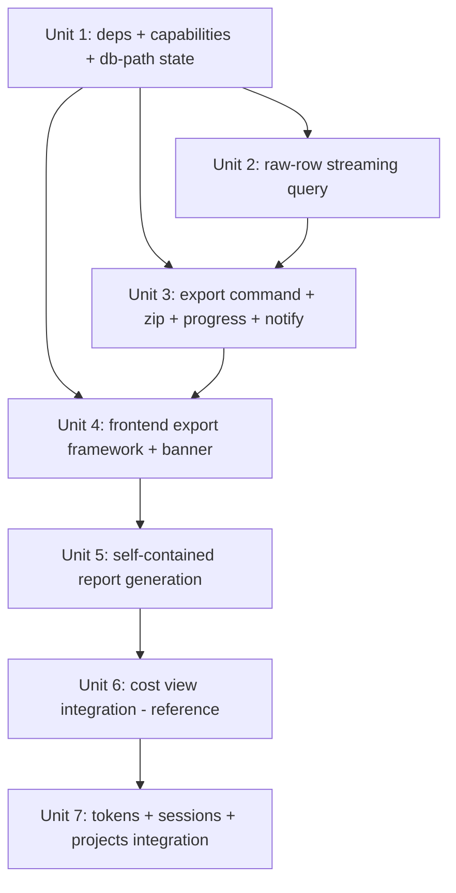

# feat: Report Export (Spend Export Bundles)

## Overview

Add a per-view "Export" action to each of Farthing's four report views (`cost`, `sessions`, `tokens`, `projects`). Clicking Export snapshots the current filters and view state, opens a native save dialog, and writes a `.zip` containing a self-contained HTML report (reproducing the on-screen chart/table), an aggregated CSV (the chart datapoints), and a raw CSV (every underlying request row in the filtered window). A single app-level banner shows real progress; a desktop notification fires on long exports; the saved file can be revealed in Finder.

The aggregated CSV and HTML reuse the existing query layer. The raw CSV is the one genuinely new query surface: no existing command returns unbounded, window-scoped request rows, so this plan adds a streaming raw-row reader on a dedicated read-only SQLite connection to avoid stalling live ingest.

## Problem Frame

Farthing visualizes spend but can't get it *out* — no artifact to hand a stakeholder, no archive for the books, no rows to drop into a spreadsheet (see origin: `docs/brainstorms/2026-06-12-report-export-requirements.md`). This plan delivers a faithful, shareable snapshot of one view under its current filters.

## Requirements Trace

- R1. Export action in each of the four view headers.
- R2. Click captures a synchronous snapshot (facets + view toggle/sort + report content) then opens a native save dialog.
- R3. Self-describing default filename encoding view, date, range, and active facets.
- R4. Bundle reflects the full filtered dataset, not the paginated/visible window; on-screen grouping/sort carries into the report.
- R5. Zip contains one HTML report + one aggregated CSV + one raw CSV.
- R6. HTML is a single self-contained file (inline CSS + inline SVG, no external assets) with an identity header, the embedded chart/table, totals, and the aggregated table.
- R7. Aggregated CSV = one row per chart/table datapoint.
- R8. Raw CSV = one row per underlying request row, request-level columns, home-relativized paths.
- R9. HTML/aggregated/raw reconcile against unrounded values, unpriced rows as 0, errors accounted for.
- R10. Single non-blocking app-level banner; exports serialized (Export disabled while in flight).
- R11. Progress bar tracks real work (rows streamed / bytes written), not a fixed animation.
- R12. Success → completion banner + reveal affordance; notification only when slow (>~2s) or user navigated away; best-effort if permission denied.
- R13. Failure → clean abort, actionable error, no partial `.zip` (temp-then-atomic-rename), button re-enabled.
- R14–R17. Per-view fidelity: cost (stacked bars, current grouping), tokens (token/cache charts), sessions (table, current sort), projects (table, cost-share).
- R18. Empty filtered window → guarded before the dialog opens with a non-error message.

## Scope Boundaries

- No scheduled/recurring/auto exports.
- No cloud upload, email, or share-link delivery — local file only.
- No PDF or formats beyond HTML + CSV.
- No cross-view "export everything" bundle — export is strictly per-view.
- No user customization of report styling or column selection.
- No new frontend test framework — the repo has none today; introducing vitest is out of scope (see Open Questions).

### Deferred to Separate Tasks

- Capture the second-read-connection + streaming-export rationale in a `docs/notes/` entry: follow-up doc task in this repo (mirrors the cost-notifications plan's documentation commitment).

## Context & Research

### Relevant Code and Patterns

- **Command + registration:** `src-tauri/src/queries.rs` (`#[tauri::command]` fns taking `app: AppHandle<R>`, locking `DbState`, delegating to pure `*_for(&db, …)` helpers); registered in the `tauri::generate_handler![…]` list in `src-tauri/src/lib.rs` (~lines 144-169). `usage_summary` (`queries.rs:373-382`) is the canonical shape.
- **Facet machinery:** `Facets` (`queries.rs:144-152`), `FacetFilter` (`queries.rs:170-182`), `Facets::filter(include_time, now)` (`queries.rs:188-234`). `session_detail_for` (`queries.rs:809-846`) is the closest template for a raw per-row SELECT — reuse its filter-build + `params_from_iter` pattern, drop the session pin and the `LIMIT`.
- **DB + concurrency:** `DbState(pub Arc<Mutex<Db>>)` (`db.rs:189-192`); single `Connection` shared with the OTLP ingest task (`ingest.rs:362-385` write path). WAL + `busy_timeout=5000` set in `configure_connection` (`db.rs:265-274`). `Db` holds only `conn` and exposes no path getter — a second connection requires the db path from elsewhere.
- **Events:** `app.emit(INGESTED_EVENT, payload)` (`lib.rs:80`, const `ingest.rs:44`); frontend `listen` in `src/routes/popover/+page.svelte:105-117` with `$effect` cleanup. Template for export progress.
- **Chart:** `src/lib/StackedBarChart.svelte` (inline SVG `<rect>`s, `viewBox`, `preserveAspectRatio="none"`; structural CSS lines 121-170; peak caption + axis siblings). PALETTE + legend logic + card CSS live in the **page**, not the component: `src/routes/(app)/cost/+page.svelte:32-45` (PALETTE/sentinels), `:106-167` (legend + buckets derivations), `:267-439` (CSS, incl. `@media (prefers-color-scheme: dark)`). `tokens` reuses `StackedBarChart`.
- **State + layout:** shared `facets` `$state` in `src/lib/facets.svelte.ts:65`; per-view toggle e.g. `let stack = $state("none")` in `cost/+page.svelte:47`; app shell `src/routes/(app)/+layout.svelte` (`.content` wraps `FacetBar` + `<main class="page">`) — banner mounts here. State-machine reference `settings/+page.svelte:22-23,138-215`; stale-async token guard `cost/+page.svelte:54,60,69`.
- **File/opener:** atomic temp-then-rename write pattern in `pricing.rs:453` / `settings_merge.rs:468`. `revealItemInDir(path)` exported by the already-installed `@tauri-apps/plugin-opener` (`node_modules/@tauri-apps/plugin-opener/dist-js/index.d.ts:49-50`) — covers reveal-in-Finder. `home_dir` command `queries.rs:1035-1041`; `cleanPath`/`projectName`/`formatCost`/`formatTokens`/`formatDate` in `src/lib/format.ts`.
- **Tests:** Rust uses `tempfile::TempDir` + `Db::open_in_dir` (`queries.rs:1063-1067`), `insert_session`/`insert_request` fixtures, `serde_json::to_value` round-trips (`queries.rs:1495+`), and `EXPLAIN QUERY PLAN` assertions (`plan_for`, `queries.rs:2179-2187`). Commands tested via `tauri::test::mock_builder()` (`queries.rs:2141-2174`). **No frontend test runner.**

### Institutional Learnings

- No `docs/solutions/` or `__knowledgebase__/` exists — project docs are authoritative.
- **Sibling cost-notifications plan** (`docs/plans/2026-06-12-001-feat-cost-notifications-plan.md`) is the precedent for `tauri-plugin-notification`: pin `"2.3"` (sound landed 2.3.1; align `tauri`/`@tauri-apps/api` to the 2.6+ line); drive from Rust via `NotificationExt` (JS plugin package not needed); **notifications silently no-op under `tauri dev`** — validate only with a bundled, signed `.app`; denied permission **cannot be re-prompted programmatically** (deep-link to System Settings); add `notification:default` to capabilities defensively even though pure-Rust calls aren't gated.
- **Architecture** (`docs/architecture.md`): WAL, single process, seeded 1M-row latency gate (<500ms warm) — reuse that gate to validate the streaming export.

### External References

- None required — the codebase has strong local patterns for every layer except the zip crate (new dependency).

## Key Technical Decisions

- **Frontend generates the HTML + aggregated CSV; Rust streams the raw CSV and assembles the zip.** The frontend already owns PALETTE, legend ordering, formatters, and the snapshotted series, so it produces `report.html` and `summary.csv` as in-memory strings. These are small (aggregated data). The raw CSV is potentially millions of rows, so Rust streams it directly from the DB — never passed through the frontend or held in memory.
- **Regenerate the chart as clean self-contained SVG from snapshotted data — do NOT serialize the live DOM.** DOM serialization fights Svelte's scoped-class hashing and requires computed-style extraction, and still misses the legend/axis/peak siblings. Regenerating from the snapshotted `SeriesPoint[]` + PALETTE/legend mapping naturally captures the toggle state (the toggle determines which series was fetched) and produces markup that renders standalone. Resolves the brainstorm's chart-capture open question.
- **Dedicated read-only connection for the raw-row scan, opened read-only.** A long All-time scan must not hold the shared `Arc<Mutex<Db>>` and stall live ingest (R10). The export opens a fresh connection via `rusqlite::Connection::open_with_flags(db_path, OpenFlags::SQLITE_OPEN_READ_ONLY)` — explicitly **not** `Db::open` (which re-runs `configure_connection`'s WAL pragmas and `apply_migrations`, both writes against a live file). This enforces the "never writes to `usage.db`" invariant rather than asserting it; a test confirms an INSERT on the export connection errors. `data_dir` is already a local in `lib.rs` setup — wrap it as `app.manage(DbPath(data_dir.clone()))` immediately after the existing `manage(DbState(...))` (one line; no `Db` change).
- **Single consistent read point for aggregated + raw (point-in-time).** To keep the aggregated CSV, the embedded chart, and the raw CSV reconcilable (R9), all data reads happen on the one read-only export connection at export time, not from stale frontend `$state`. WAL gives that connection a consistent snapshot for its lifetime. See Open Questions for the resolved data-flow (Rust returns the consistent aggregated series/rollups + counts; the frontend renders the chart from *those*, not from previously-loaded view state) — this also fixes the sessions case, where the frontend only holds the visible pages.
- **Raw CSV includes `api_error` rows, streamed, no hard cap.** "Every underlying request row" includes errors; the `event_type` column distinguishes them. The HTML identity header carries both the `api_request` count (matches aggregated `requests`) and the error count so a raw row-count exceeding the aggregated total reads as explained (R9). No `DETAIL_REQUEST_LIMIT`-style cap; validate streaming at 1M rows against the existing latency gate.
- **Progress total = `api_request` + `api_error` rows.** `summary.requests` excludes errors, but the raw CSV includes them — so the denominator is `summary.requests + summary.errors` (both already in the loaded summary; no extra query), and progress is clamped to ≤100% defensively. The empty guard (R18) likewise checks `summary.requests === 0 && summary.errors === 0` (matching the existing `isEmpty` derivation in `cost/+page.svelte`), so an error-only window still exports.
- **Reconciliation carries exact values.** The HTML embeds unrounded numeric totals (alongside `formatCost`-rendered display values) so the standalone report's check holds; cost sums treat unpriced (`cost_usd` NULL) rows as 0. The series the chart is built from is clamped to the same window as the raw scan (see Open Questions — the on-screen series is capped at `MAX_SERIES_DAYS=1830`, so the raw window must match or the header must disclose the truncation).
- **One global serialized export.** A new shared `export` `$state` module (mirroring `facets.svelte.ts`) holds banner status; the app-level banner lives in `+layout.svelte`; the Export action is disabled while `status !== "idle"`.
- **Progress over the emit/listen rails.** Rust emits `export:progress` (`{ phase, rowsWritten, totalRows }`) via the `AppHandle` it already holds; the banner listens with `$effect` cleanup. Threshold: estimated rows below a small bound (or sub-~300ms) shows an indeterminate/quick state with no artificial delay.
- **Notification gating + reveal.** Notification fires from Rust only when elapsed > ~2s or the user navigated away from the originating view (frontend passes the originating route; Rust decides on elapsed, frontend supplements on navigation). Best-effort on denied permission. Reveal uses `revealItemInDir` from the installed opener plugin.

## Open Questions

### Resolved During Planning

- **Chart capture:** regenerate from snapshotted data (not DOM serialization). See Key Technical Decisions.
- **DB concurrency:** dedicated connection opened with `SQLITE_OPEN_READ_ONLY` via db-path Tauri state. See Key Technical Decisions.
- **Data-flow / consistency:** the export command (Rust) reads the aggregated rollups/series, the counts, and the raw rows on its one read-only connection at export time. It returns the consistent aggregated series + counts to the frontend, which renders `report.html` (chart from *that* series using the frontend's PALETTE/legend/formatters) and `summary.csv`, then invokes the write with the HTML + summary strings; Rust streams the raw CSV and assembles the zip. This keeps rendering logic frontend-side while sourcing all numbers from one point-in-time read — and resolves the sessions case (the frontend's loaded `$state` only holds the visible pages, so the aggregated set must come from Rust, not state).
- **Raw-row reader shape:** streaming row iterator writing incrementally to a temp CSV; no Vec materialization; no row cap.
- **`api_error` rows:** included in raw CSV with `event_type` column; progress denominator is `requests + errors`; reconciliation defined over `api_request` priced rows.
- **All-time window cap:** the raw scan window is clamped to the same resolved window the chart/series uses (`MAX_SERIES_DAYS=1830`), so all three artifacts cover identical windows; if a full uncapped raw export is wanted instead, the header must disclose that the chart shows only the most recent 1830 days. (Decision: clamp for reconciliation parity.)
- **Reveal-in-Finder:** `revealItemInDir` from `@tauri-apps/plugin-opener` (already installed); `opener:default` already grants `allow-reveal-item-in-dir` (confirmed in the resolved ACL manifest) — no new permission needed.
- **Default filename:** `farthing-<view>-<YYYY-MM-DD>-<range>[-<source>][-<grouping>].zip`, facet segments slugified and length-bounded; the date stamp also disambiguates repeat exports. Save dialog lets the user rename.

### Deferred to Implementation

- Exact progress-emit cadence/throttle (per-N-rows vs per-time) — tune against the 1M-row gate so emits don't flood the webview.
- Whether `revealItemInDir` is covered by `opener:default` or needs an explicit permission entry — confirm when wiring capabilities; add the specific permission if the call is denied.
- Precise SVG dimensions/viewBox for the regenerated report chart vs. the on-screen `preserveAspectRatio="none"` sizing — settle when building the report template against the standalone smoke test.
- Whether the report-generation logic warrants introducing a frontend test runner — deferred; for now it is a pure function verified by the standalone smoke test (kept pure so a future vitest setup can cover it without refactor).

## High-Level Technical Design

> *This illustrates the intended approach and is directional guidance for review, not implementation specification. The implementing agent should treat it as context, not code to reproduce.*

Export flow (click → bundle):

```mermaid
sequenceDiagram
    participant U as User
    participant V as View (+page.svelte)
    participant R as Report gen (frontend)
    participant D as Dialog plugin
    participant C as export command (Rust)
    participant DB as read-only Connection
    participant B as App banner (+layout)

    U->>V: Click Export
    V->>V: snapshot facets + toggle/sort + originRoute (sync); status="preparing"
    V->>C: prepare: consistent read (aggregated series/rollups + requests/errors counts)
    C->>DB: open read-only conn (SQLITE_OPEN_READ_ONLY)
    DB-->>C: aggregated data + counts (point-in-time)
    C-->>V: aggregated series + counts
    V->>V: empty guard (requests==0 && errors==0) -> guarded, return (R18)
    V->>R: build report.html + summary.csv from consistent series
    V->>D: save dialog (default filename)
    D-->>V: chosen path (or cancel)
    V->>C: invoke export(path, facets, html, summaryCsv, totalRows)
    V->>B: status="working"
    C->>DB: stream raw rows (same read-only conn / point-in-time)
    loop stream raw rows
        DB-->>C: row batch
        C->>C: write requests.csv (temp)
        C-->>B: emit export:progress {rowsWritten,totalRows} (throttled)
    end
    C->>C: validate destination; zip to temp; atomic rename -> chosen path
    C-->>V: ExportResult { elapsed_ms }
    C-->>B: emit export:progress {phase:"done"}
    V->>V: fire notification once if elapsed>2s OR route changed (frontend-owned)
    B->>U: completion + Show in Finder (revealItemInDir, try/catch)
```

Unit dependency graph:



## Implementation Units

- [ ] **Unit 1: Dependencies, capabilities, and read-only-connection plumbing**

**Goal:** Add the new dependencies and expose the db path so later units can open a read-only export connection and call the dialog/notification plugins.

**Requirements:** None — enabling infrastructure for R2/R10/R12, owned by later units.

**Dependencies:** None

**Files:**
- Modify: `src-tauri/Cargo.toml` (add `tauri-plugin-dialog`, `tauri-plugin-notification = "2.3"`, a `zip` crate)
- Modify: `src-tauri/src/lib.rs` (register the dialog plugin; `app.manage(DbPath(data_dir.clone()))`)
- Modify: `src-tauri/capabilities/default.json` (add `dialog:allow-save` and `notification:default`)
- Modify: `package.json` (add `@tauri-apps/plugin-dialog` JS API; notification driven from Rust, no JS package needed)
- Test: `src-tauri/src/db.rs` (test block) — read-only-connection behavior (see scenarios)

**Approach:**
- `data_dir` is already computed in `setup`; wrap it as `app.manage(DbPath(data_dir.clone()))` immediately after the existing `manage(DbState(...))`. One line — do not add a field to `Db`.
- Register `tauri-plugin-dialog`; notification stays Rust-side (`NotificationExt`).
- Pin notification to `"2.3"`. The installed `tauri` is already 2.11.2 and `@tauri-apps/api` is `^2`, so the 2.6 core-dep floor is already satisfied — no version realignment needed.
- Scope the dialog capability to `dialog:allow-save` (save dialog only), not the broader `dialog:default`.

**Patterns to follow:** plugin registration in `lib.rs:26` (opener); state management `lib.rs:62-63` (`app.manage(DbState(...))`); capability entries in `capabilities/default.json`.

**Test scenarios:**
- Happy path: a connection opened with `OpenFlags::SQLITE_OPEN_READ_ONLY` to the managed `DbPath` returns rows while the shared `DbState` mutex is held (proves the WAL concurrent-reader property the export relies on).
- Error path: an `INSERT` on the read-only export connection returns an error (enforces the never-writes invariant).

**Verification:** `cargo build` and `pnpm tauri build` succeed with the new deps; capabilities JSON validates; app launches and the dialog plugin is callable.

---

- [ ] **Unit 2: Streaming raw-row export query**

**Goal:** A faceted, window-scoped, unbounded reader over `requests` that streams rows for the raw CSV without holding the shared DB mutex.

**Requirements:** R4, R8, R9, R11

**Dependencies:** Unit 1

**Files:**
- Modify: `src-tauri/src/queries.rs` (add `export_raw_rows_for` with an `exclude_sessionless: bool` param + a row struct or column contract; the progress denominator is `summary.requests + summary.errors` from the existing `summary_for` — no new count helper needed)
- Test: `src-tauri/src/queries.rs` (test block)

**Approach:**
- Build the WHERE via `facets.filter(true, now)`; bind with `params_from_iter(filter.params.iter())` exactly like `session_detail_for`, minus the session pin and the `LIMIT`.
- Select request-level columns: `timestamp_ms, model, query_source, event_type, source, cost_usd, input_tokens, output_tokens, cache_read_tokens, cache_creation_tokens, duration_ms, error` plus `session_id`/`cwd` (joined) for the path column. Home-relativize `cwd` to `~/...` using the home dir (R8).
- **`error` column sanitization:** inspect how `error` strings are written in `ingest.rs` before finalizing. If they can contain absolute file paths, request/response fragments, or token material, sanitize/truncate in the export query (the artifact is shared) — or document explicitly that the stored error text is a safe category string. Resolve before implementing this unit.
- Expose a streaming shape (`query_map` row iterator with a per-row callback) so Unit 3 writes incrementally — do not return a `Vec`.
- Include `api_error` rows (no `event_type` filter); deterministic order `timestamp_ms, id`. The `exclude_sessionless` flag adds `r.session_id IS NOT NULL` — the **sessions** view passes `true` so its raw CSV matches the session-rollup row set (R16) and orders by `session_id, timestamp_ms`; the other three views pass `false`.
- This is a main-table read (needs non-indexed `error`/`duration_ms`/`source`), like the `session_detail` timeline.

**Execution note:** Add an `EXPLAIN QUERY PLAN` test. An All-time raw export is a main-table scan by design (`error`/`duration_ms`/`source` are in no covering index); assert it scans in `timestamp_ms` order via the timestamp-leading index/rowid **without a separate SORT step**, not that it is index-only.

**Patterns to follow:** `session_detail_for` (`queries.rs:809-846`); `plan_for` query-plan tests (`queries.rs:2179-2187`); fixture helpers `insert_session`/`insert_request`.

**Test scenarios:**
- Happy path: window with mixed models/sources returns every matching row in deterministic order; cwd rendered as `~/...`.
- Happy path: facet filters (range, project, model, source) restrict the row set identically to the aggregated queries over the same facets.
- Edge case: empty window yields zero rows (no error).
- Edge case: `api_error` rows are present and carry `event_type='api_error'` with null cost/model.
- Edge case: with `exclude_sessionless=false`, session-less rows (`session_id IS NULL`) appear with an empty/unknown project column; with `exclude_sessionless=true`, they are excluded and the row set matches `session_rollups_for` over the same facets (R16).
- Integration: summed unrounded `cost_usd` (unpriced as 0) over `api_request` rows equals `summary_for` cost for the same facets (R9).
- Query plan: `EXPLAIN QUERY PLAN` confirms expected index usage / no unexpected full-scan-with-sort regression.

**Verification:** Tests pass; a manual All-time export over a seeded large DB streams without loading all rows into memory.

---

- [ ] **Unit 3: Export command — zip assembly, atomic write, progress, notification**

**Goal:** The Tauri command that receives the prebuilt HTML + aggregated CSV, streams the raw CSV from a read-only connection, assembles the zip atomically, emits progress, and fires the gated notification.

**Requirements:** R5, R8, R9, R11, R12, R13

**Dependencies:** Units 1, 2

**Files:**
- Create: `src-tauri/src/export.rs` (command + zip/stream/notify logic; event const `EXPORT_PROGRESS_EVENT = "export:progress"`)
- Modify: `src-tauri/src/lib.rs` (register `export` command in `generate_handler!`; `mod export`)
- Test: `src-tauri/src/export.rs` (test block)

**Approach:**
- Signature: `export(app, destination: String, facets: Facets, report_html: String, summary_csv: String, total_rows: u64) -> Result<ExportResult, String>` where `ExportResult` carries `elapsed_ms` so the frontend owns the notification decision (see notification note).
- Open the export connection with `Connection::open_with_flags(db_path, OpenFlags::SQLITE_OPEN_READ_ONLY)` (Unit 1 `DbPath` state) — do **not** call `Db::open`/`configure_connection`/`apply_migrations`. WAL concurrent reader, consistent point-in-time for the scan.
- **Validate `destination`** before writing: it comes from the native save dialog, but guard defensively — require an absolute path whose parent directory exists and is writable, and enforce the `.zip` extension. Reject otherwise with an actionable `Err`.
- **`report_html` is frontend-supplied and written verbatim into a file meant to be opened in a browser.** Mitigate stored-XSS risk: embed a restrictive `<meta http-equiv="Content-Security-Policy">` in the report template (no inline/remote script) and document that the generator must not emit `<script>`. (Alternative considered: build the HTML in Rust — rejected to keep PALETTE/formatters frontend-side.)
- Write `report.html` and `summary.csv` (provided strings) and stream `requests.csv` from Unit 2 into a zip built at a **temp path**; `std::fs::rename` to `destination` only on full success; remove temp on any error (pattern from `pricing.rs:453`).
- Emit `EXPORT_PROGRESS_EVENT` `{ phase, rows_written, total_rows }` throttled to ~every N rows or ~every 100ms (whichever is coarser) so a 1M-row stream doesn't flood the webview IPC; terminal `{ phase: "done" }` / error. `total_rows` is passed in (`requests + errors`) so the bar is determinate from the first event; clamp displayed progress to ≤100%.
- Notification ownership lives **entirely in the frontend** (Rust cannot observe SvelteKit route changes): the command returns `elapsed_ms`, and the frontend fires exactly one notification if `elapsed_ms > ~2s` OR the user navigated away from the originating route, guarded so it can't double-fire.

**Execution note:** Start with a failing test for the atomic-write contract (no file at destination on simulated mid-stream failure).

**Patterns to follow:** command shape `queries.rs:373-382`; emit `lib.rs:80` / `ingest.rs:44`; atomic write `pricing.rs:453`; notification discipline from `docs/plans/2026-06-12-001-feat-cost-notifications-plan.md`.

**Test scenarios:**
- Happy path: valid inputs produce a `.zip` at `destination` containing exactly `report.html`, `summary.csv`, `requests.csv`; `requests.csv` row count matches Unit 2 over the same facets.
- Error path: simulated write failure mid-stream leaves no file at `destination` and no temp residue.
- Error path: unwritable destination directory returns an actionable `Err(String)`, no partial file.
- Error path: a `destination` whose parent doesn't exist, isn't writable, or lacks a `.zip` extension is rejected before any write.
- Edge case: zero-row window (if reached) produces a valid zip with header-only `requests.csv` (the empty guard normally prevents this; the command must still not panic).
- Integration: progress events emit during a large stream and a terminal `done` event fires once.

**Verification:** Tests pass; manual export opens as a valid zip; mid-failure leaves the destination clean.

---

- [ ] **Unit 4: Frontend export framework — shared state, app-level banner, progress listener, orchestration**

**Goal:** The reusable, view-agnostic export machinery: a shared export `$state`, the app-level banner in the layout, the progress listener, and the orchestration (empty guard → dialog → invoke → reveal → notification-on-navigation), with serialized single-export behavior.

**Requirements:** R2, R3, R10, R11, R12, R13, R18

**Dependencies:** Units 1, 3

**Files:**
- Create: `src/lib/export.svelte.ts` (shared `export` state: `status: "idle" | "preparing" | "working" | "done" | "error" | "guarded"`, progress, last-saved path, originRoute, message; the `runExport(...)` orchestrator; default-filename builder)
- Create: `src/lib/ExportBanner.svelte` (the banner UI with progress bar + Show-in-Finder + dismiss)
- Modify: `src/routes/(app)/+layout.svelte` (mount `ExportBanner` in `.content` above `<main class="page">`)
- Modify: `src/lib/queries.ts` (typed `invoke` wrapper for the `export` command; `EXPORT_PROGRESS_EVENT` const + payload type)
- Test: none — no frontend test runner; verified manually (see Verification). Keep `runExport`/filename builder pure for future testability.

**Approach:**
- `runExport({ view, facets, originRoute, prepare })`: **set `status="preparing"` synchronously as the first statement** — before fetching the consistent aggregated data, building the report, or opening the dialog — so a second Export click from any view sees a non-idle status and is blocked (closes the click-window race where status was only set after the dialog `await`). Revert to `idle` on dialog cancel.
- `prepare` performs the consistent read (Rust returns aggregated series/rollups + `requests`/`errors` counts), runs the empty guard (`requests === 0 && errors === 0` → `status="guarded"`, transient "No data matches the current filters" message, auto-clear after ~4s, **return before the dialog**, R18), then builds `reportHtml` + `summaryCsv` and `totalRows = requests + errors`.
- Build default filename (R3); open save dialog; on cancel → `idle`; else `status="working"`, `invoke("export", …)`, listen for progress.
- Serialize: expose an `isExporting` derived (`status !== "idle"`); views disable their Export button via the `disabled` attribute (not just CSS) so keyboard tab order skips it; also disable Export while the view's own data is still `loading` so the snapshot is never of undefined state.
- Progress listener mirrors `popover/+page.svelte:105-117` (`listen` + `$effect` cleanup). On `done`: `status="done"`, store path; the banner shows Show-in-Finder (`revealItemInDir`, wrapped in try/catch — surface a brief "file no longer at <path>" note if it was moved/deleted). Fire exactly one notification if `elapsed_ms > ~2s` OR current route !== `originRoute`, guarded against double-fire.
- **Banner lifecycle:** `done` auto-dismisses after ~8s (or immediately once Show-in-Finder is clicked) and resets status to `idle`; `error` and `guarded` require/auto-clear as noted; the banner is `position: sticky; top: 0` within `.content` (above a z-index for the scrolling page) so it stays visible during a long export in the constrained window. Show-in-Finder/dismiss are keyboard-focusable (Enter/Space); the banner is non-modal so no focus trap.

**Patterns to follow:** `facets.svelte.ts` (module `$state`); `settings/+page.svelte` state machine; `popover/+page.svelte` listen/cleanup; `revealItemInDir` from `@tauri-apps/plugin-opener`; the existing `isEmpty` derivation in `cost/+page.svelte` for the empty guard.

**Test scenarios:** Test expectation: none — no frontend test framework exists (out of scope to add). Verified via the manual scenarios in Verification; orchestration kept pure for later coverage.

**Verification:**
- Manual: trigger export, banner appears app-level, persists when navigating between views, disables Export elsewhere, completes with Show-in-Finder revealing the file.
- Manual: empty-filter export shows the guard message and never opens the dialog.
- Manual: cancelling the dialog returns to idle with no error and re-enabled button.
- Manual: write error surfaces an actionable banner error and re-enables the button.

---

- [ ] **Unit 5: Self-contained report generation (HTML + aggregated CSV)**

**Goal:** Pure frontend functions that turn a snapshotted view into a standalone `report.html` string (identity header + inline-CSS + inline-SVG chart or table + totals + aggregated table) and a `summary.csv` string.

**Requirements:** R6, R7, R9, R14–R17

**Dependencies:** Unit 4

**Files:**
- Create: `src/lib/report/buildReport.ts` (identity header, totals with unrounded + display values, aggregated-table + CSV serialization; shared across views)
- Create: `src/lib/report/chartSvg.ts` (regenerate a standalone stacked-bar SVG from `SeriesPoint[]` + legend/PALETTE; inline styles; include axis labels, peak caption, legend, dark/light)
- Modify: `src/lib/format.ts` (only if a shared formatter needs to be exported for reuse — avoid duplicating)
- Test: none — no frontend test runner; verified via the standalone smoke test. Functions kept pure.

**Approach:**
- Regenerate, don't serialize: build SVG markup from the **consistent series returned by the export command's read** (not stale view `$state`) + the same legend ranking/PALETTE folding the page uses (`cost/+page.svelte:106-167`), emitting inline `fill`/style so the file renders with the app closed.
- Identity header states view name, resolved date window, source, project/model filters (where applicable), grouping (where applicable) (R6).
- Embed exact unrounded totals as data plus `formatCost`/`formatTokens` display values; include unpriced-request and error counts (R9).
- CSV: aggregated rows = the exact chart/table datapoints (day×group for cost/tokens series; session rollups for sessions; project rollups for projects) (R7).
- **Report visual design (it's a "beautified" shareable artifact, not raw output):** establish a small, deliberate report stylesheet — a clear identity header (title + filter chips + generated-on date), a prominent totals band, the chart, then the aggregated table with readable typography and spacing. Define the look explicitly rather than emitting a default-browser table; mirror the app's PALETTE for chart colors but use a neutral, print-friendly document style for the surrounding chrome (this is handed to a stakeholder and may be printed/pasted into a deck).
- **Dark/light strategy:** decide one of (a) fixed light appearance regardless of viewer OS (most defensible for a handed-off/printed artifact — recommended), or (b) inline `@media (prefers-color-scheme: dark)` mirroring `cost/+page.svelte:267-439` so the file adapts to the recipient's OS. PALETTE hexes are theme-independent. Pick one and state it; do not leave the smoke test asserting "both" without a chosen strategy.

**Patterns to follow:** PALETTE/legend/buckets derivations in `cost/+page.svelte:32-167`; `StackedBarChart.svelte` SVG structure; `format.ts` formatters.

**Test scenarios:** Test expectation: none (no frontend test framework). Critical verification is the standalone smoke test below; logic kept pure for future vitest coverage.

**Verification:**
- Smoke test (the gating criterion): write a `report.html` to disk, open it in a browser **with the app not running** — chart renders fully (bars, axis labels, legend, baseline, peak caption) in both light and dark, no broken assets.
- Manual: aggregated CSV rows match the on-screen chart/table datapoints exactly; embedded unrounded totals reconcile with the raw CSV sums from a paired export.

---

- [ ] **Unit 6: Cost view integration (reference implementation)**

**Goal:** Wire the full pipeline into the `cost` view as the proving ground — the hardest case (chart + grouping + legend).

**Requirements:** R1, R2, R4, R14

**Dependencies:** Unit 5

**Files:**
- Modify: `src/routes/(app)/cost/+page.svelte` (Export button in the view header; synchronous snapshot of `facets` + `stack`; call `buildReport`/`chartSvg`; `runExport`; disable while exporting)
- Test: none — manual end-to-end verification.

**Approach:**
- On click, *synchronously* snapshot `facets`, `stack`, and the originating route, then call `runExport` (which sets `status="preparing"` synchronously, performs the consistent Rust read, runs the empty guard on the returned `requests`/`errors` counts, builds the report, opens the dialog).
- The empty guard and progress total come from the consistent read's counts (`requests === 0 && errors === 0` guard; `requests + errors` denominator) — not from the view's possibly-stale loaded `$state`.
- Disable the Export button while the view's own data is still `loading`.

**Patterns to follow:** existing header/toggle markup and `stack` state in `cost/+page.svelte`; the stale-async token guard already there; the `isEmpty` derivation for the guard.

**Test scenarios:** Test expectation: none (no frontend test framework) — covered by end-to-end Verification.

**Verification:**
- Manual E2E: export the exact view from the brainstorm (Cost over time, Last 7 days, Main only, By model) → zip contains a report titled "Cost over time" with those filters, a by-model stacked chart, `summary.csv` of day×model rows, and `requests.csv` of the underlying rows; totals reconcile.
- Manual: toggling grouping immediately after click does not change the produced bundle (synchronous snapshot).

---

- [ ] **Unit 7: Tokens, sessions, and projects integration**

**Goal:** Plug the remaining three views into the framework, reusing Units 4–5; tokens is chart-based, sessions/projects are table-based.

**Requirements:** R1, R2, R4, R15, R16, R17

**Dependencies:** Unit 6

**Files:**
- Modify: `src/routes/(app)/tokens/+page.svelte` (Export; token/cache chart report; state whether tokens has a grouping toggle and carry it or note none — R15)
- Modify: `src/routes/(app)/sessions/+page.svelte` (Export; table report in current sort; aggregated CSV = all session rollups across pages; raw CSV uses the session row set + `session_id, timestamp` order — R16)
- Modify: `src/routes/(app)/projects/+page.svelte` (Export; table report with cost-share; aggregated CSV = project rollups — R17)
- Test: none — manual end-to-end verification per view.

**Approach:**
- Tokens: reuse `chartSvg` for the token/cache series; resolve the grouping-toggle question explicitly in code + report header.
- Sessions: aggregated CSV must cover all pages (query the full rollup set, not the visible page); raw CSV for this view restricts to the session row set so R9 holds.
- Projects: table report + the cost-share visualization rendered as inline markup.

**Patterns to follow:** Unit 6; each view's existing data-loading and toggle/sort state.

**Test scenarios:** Test expectation: none (no frontend test framework) — covered by per-view E2E Verification.

**Verification:**
- Manual E2E per view: report identity header matches active filters; aggregated CSV matches the on-screen datapoints (all pages for sessions); raw CSV reconciles; standalone HTML renders with app closed.
- Manual: sessions raw CSV excludes session-less rows and is ordered by `session_id, timestamp`.

## System-Wide Impact

- **Interaction graph:** New `export` command + `export:progress` event join the existing IPC surface. The app-level banner in `+layout.svelte` is a new global UI element shared by all four views.
- **Error propagation:** Rust command returns `Result<_, String>`; failures surface in the banner and re-enable the Export button (R13). Notification failures (denied permission) are swallowed best-effort.
- **State lifecycle risks:** Temp-then-atomic-rename prevents partial `.zip`. Serialized exports prevent concurrent-banner races. Synchronous snapshot prevents chart/CSV desync.
- **API surface parity:** All four views must expose Export consistently (R1); Units 6–7 ensure parity. The export command is view-agnostic — per-view differences live entirely in report generation.
- **Integration coverage:** The DB-concurrency claim (export read connection does not stall ingest) and the streaming-memory claim are only proven by an integration run against a seeded large DB — covered in Unit 2/3 verification, not unit tests.
- **Unchanged invariants:** No change to how cost/usage is computed, the `requests`/`sessions` schema, existing queries, or the shared `facets` state. The export adds a read-only connection and never writes to `usage.db`.

## Risks & Dependencies

| Risk | Mitigation |
|------|------------|
| Long All-time scan stalls live ingest by holding the shared DB mutex | Dedicated read-only connection (WAL concurrent reader); shared lock held only briefly for the count |
| Standalone HTML renders broken (missing styles/legend/axis) | Regenerate from data (not DOM serialize); gate on the "open with app closed" smoke test |
| Large raw CSV exhausts memory | Stream row-by-row to a temp CSV; never materialize a Vec or build the zip in memory; validate at 1M rows |
| Notifications silently fail / can't be debugged under `tauri dev` | Validate only with a bundled signed `.app`; best-effort + in-app banner is primary (per cost-notifications plan) |
| Three-way reconciliation appears "wrong" due to rounding/unpriced/error rows | Embed exact unrounded values; single point-in-time read for all data; progress denominator = requests + errors; surface unpriced + error counts in the report header |
| Aggregated (chart) vs raw desync from mid-export ingest, or sessions' unloaded pages | All data read on one read-only connection at export time, not from frontend `$state` |
| `error` column or frontend HTML leaks paths/tokens into a shared artifact | Inspect/sanitize `error` strings in the export query; CSP meta in the report; home-relativize paths |
| WAL checkpoint starvation during a very long All-time export | Read-only connection releases at completion; clamp raw window to the 1830-day series window |
| No frontend test framework to guard report-generation logic | Keep generation pure; rely on the standalone smoke test + E2E; defer a test runner |

## Documentation / Operational Notes

- Add a `docs/notes/` entry documenting the second-read-connection + streaming-export rationale (there is no `docs/solutions/` to capture it), so the next feature inherits the pattern.
- New runtime dependencies: `tauri-plugin-dialog`, `tauri-plugin-notification` (2.3), a `zip` crate. Notification + dialog require capability entries.
- No migration, no schema change, no rollout flag — the feature is additive and read-only.

## Sources & References

- **Origin document:** [docs/brainstorms/2026-06-12-report-export-requirements.md](docs/brainstorms/2026-06-12-report-export-requirements.md)
- Related plan: `docs/plans/2026-06-12-001-feat-cost-notifications-plan.md` (notification + capability precedent)
- Related code: `src-tauri/src/queries.rs` (`session_detail_for`, `Facets::filter`), `src-tauri/src/db.rs` (`DbState`, WAL), `src-tauri/src/ingest.rs` (emit + write path), `src/lib/StackedBarChart.svelte`, `src/routes/(app)/cost/+page.svelte`, `src/routes/(app)/+layout.svelte`, `src/lib/format.ts`
- Architecture: `docs/architecture.md` (WAL, 1M-row latency gate, emit/listen pattern)
